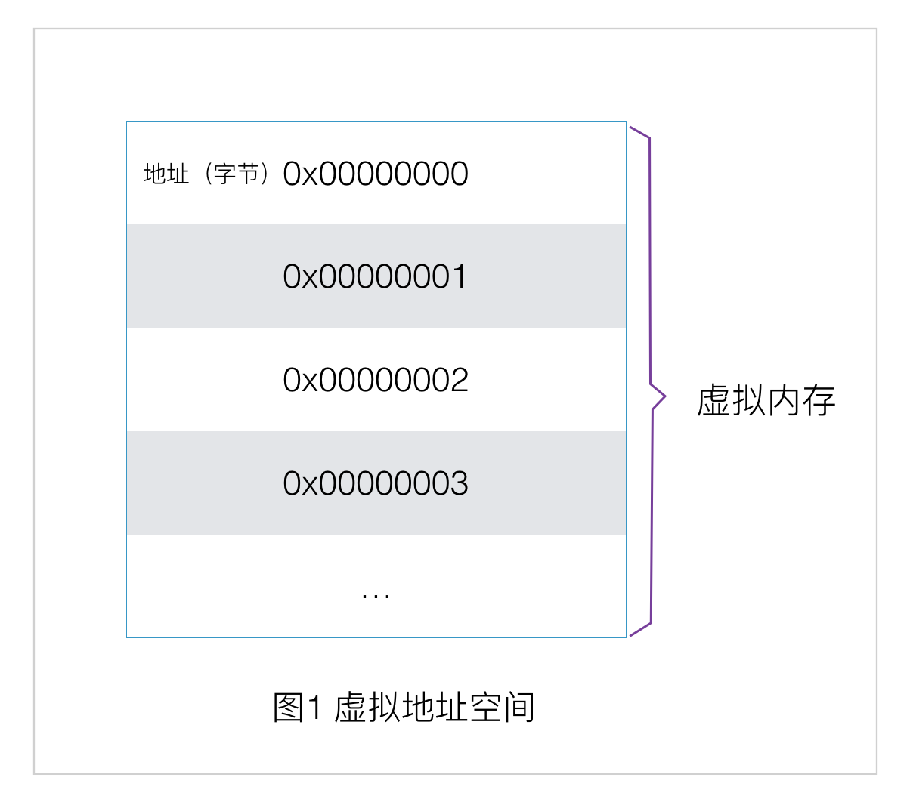
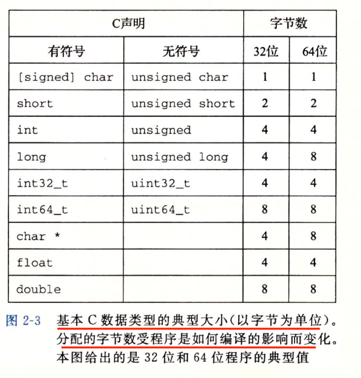
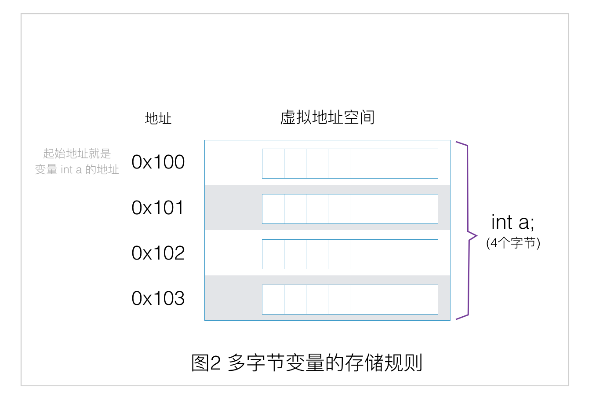
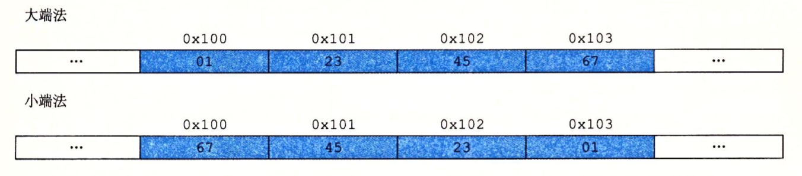
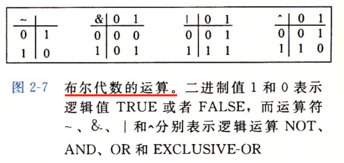
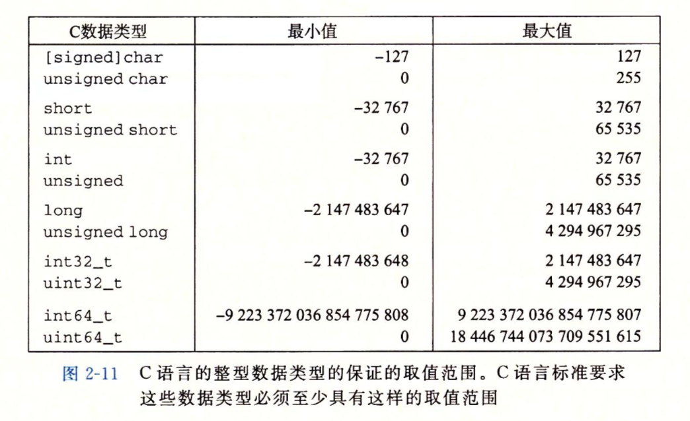
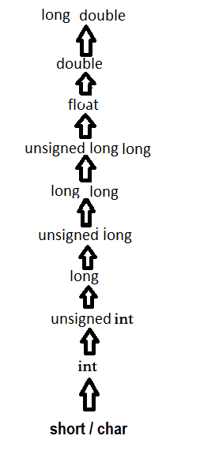
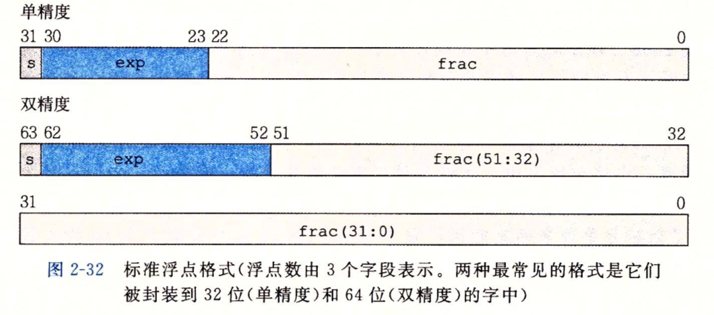
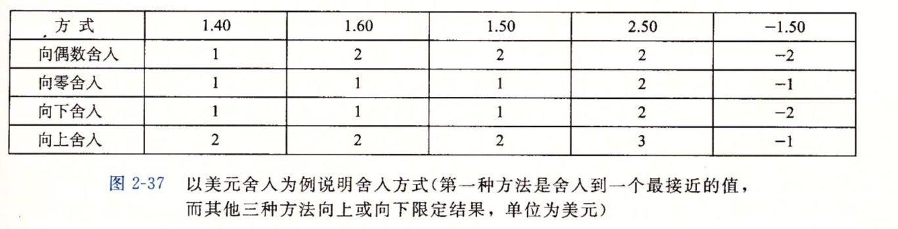

# 读《深入理解计算机系统》（二）


- [读《深入理解计算机系统》（一）](https://github.com/ShannonChenCHN/what-is-computer-science/blob/master/posts/%E8%AF%BB%E3%80%8A%E6%B7%B1%E5%85%A5%E7%90%86%E8%A7%A3%E8%AE%A1%E7%AE%97%E6%9C%BA%E7%B3%BB%E7%BB%9F%E3%80%8B_01.md)
- [读《深入理解计算机系统》（二）](https://github.com/ShannonChenCHN/what-is-computer-science/blob/master/posts/%E8%AF%BB%E3%80%8A%E6%B7%B1%E5%85%A5%E7%90%86%E8%A7%A3%E8%AE%A1%E7%AE%97%E6%9C%BA%E7%B3%BB%E7%BB%9F%E3%80%8B_02.md)
- [读《深入理解计算机系统》（三）](https://github.com/ShannonChenCHN/what-is-computer-science/blob/master/posts/%E8%AF%BB%E3%80%8A%E6%B7%B1%E5%85%A5%E7%90%86%E8%A7%A3%E8%AE%A1%E7%AE%97%E6%9C%BA%E7%B3%BB%E7%BB%9F%E3%80%8B_03.md)
- [读《深入理解计算机系统》（四）](https://github.com/ShannonChenCHN/what-is-computer-science/blob/master/posts/%E8%AF%BB%E3%80%8A%E6%B7%B1%E5%85%A5%E7%90%86%E8%A7%A3%E8%AE%A1%E7%AE%97%E6%9C%BA%E7%B3%BB%E7%BB%9F%E3%80%8B_04.md)


## 目录
- 第一部分 程序结构和执行
  - 第2章　信息的表示和处理
    - 2.1 信息存储
    - 2.2 整数表示
    - 2.3 整数运算
    - 2.4 浮点数
  - 第3章　程序的机器级表示
    - 3.1 历史观点
    - 3.2 程序编码
    - 3.3 数据格式
    - 3.4 访问信息
    - 3.5 算术和逻辑操作
    - 3.6 控制
    - 3.7 过程
    - 3.8 数组分配和访问
    - 3.9 异数的数据结构
    - 3.10 在机器级程序中将控制与数据结合起来
    - 3.11 浮点代码
  - 第4章　处理器体系结构
    - 4.1 Y86-64 指令集体系架构
    - 4.2 逻辑设计和硬件控制语言 HCL
    - 4.3 Y86-64 的顺序实现
    - 4.4 流水线的通用原理
    - 4.5 Y86-64 的流水线实现
  - 第5章　优化程序性能
    - 5.1 优化编译器的能力和局限性
    - 5.2 表示程序性能
    - 5.3 程序示例
    - 5.4 消除循环的低效率
    - 5.5 减少过程调用
    - 5.6 消除不必要的内存引用
    - 5.7 理解现代处理器
    - 5.8 循环展开
    - 5.9 提高并行性
    - 5.10 优化合并代码的结果小结
    - 5.11 一些限制因素
    - 5.12 理解内存性能
    - 5.13 应用：性能提高技术
    - 5.14 确认和消除性能瓶颈
  - 第6章　存储器层次结构
    - 6.1 存储技术
    - 6.2 局部性
    - 6.3 存储器层次结构
    - 6.4 高速缓存存储器
    - 6.5 编写高速缓存友好的代码
    - 6.6 综合：高速缓存对程序性能的影响


## 第一部分 程序结构和执行
## 第 2 章 信息的表示和处理

这一章主要讨论计算机是如何表示和处理数字（整数、小数）和其他形式的数据。

## 问题
- 不同进制之间如何转换？
- 计算机为什么用二进制来表示信息？
- 二进制中的负数怎么表示？
- 补码是什么？补码是怎么来的？
- 计算机中的浮点数是怎么表示的？
- int，int32 和 int64 的区别？为什么会有 int32 和 int64 这种数据类型？
- 现定义有 `float a = 102100.00 * 2` 和 ` float b = 0.1` 两个变量，将 a 和 b 相加得到应该是 204200.10，但是实际得到的却是 204200.09，这是为什么？


### 2.1 信息存储

在计算机中，所有的信息都是以 0 和 1 的形式存储和处理的。

一个字节有 8 位，字节是最小的可寻址内存单位，也就是说我们在访问计算机内存时，不是直接访问内存中单独的位，而是字节。

程序将内存看做一个非常大的字节数组，也就是我们常说的虚拟内存。内存的每个字节都由一个唯一的数字来标识，我们把这个数字称作地址。所有可能地址的集合就被称为虚拟地址空间。

从虚拟地址空间这个名字可以看出，这个虚拟地址空间只是一个展现给机器级程序的概念性映像。实际的实现是动态随机访问存储器、闪存、磁盘、和操作系统软件等结合起来，为程序提供一个看上去统一的字节数组。




基于此，编译器和运行时系统将存储器空间划分成更可管理的单元，来存放不同的程序对象（即程序数据、指令和控制信息）。每个程序对象可以简单地视为一个字节块，而程序本身就是一个字节序列。

#### 2.1.1 十六进制表示法

- 为什么要使用十六进制来表示字节，而不是十进制和二进制？
  - 二进制太冗长，十进制与二进制之间的转换比较麻烦
- 如何表示十六进制
  - 使用数字 0~9 和字符 A~F 来表示
  - C 语言中，以 0x 或 0X 开头的数字常量表示十六进制数


#### 2.1.2 字数据大小

- 每台计算机都有一个字长，指明指针数据的标称大小。
  - 因为虚拟地址就是以这样的一个字来编码的，所以字长决定的最重要的系统参数就是虚拟地址空间的最大大小。
  - 比如 32 位的机器上，虚拟地址的范围就是 `0` ~ `2^32 - 1`，而指针就是用来表示地址的，所以要想能够表示所有可能的地址，一个指针变量占 4 个字节，正好可以容下所有可能的虚拟地址大小；同理，在 64 位的机器上，一个指针变量占 8 个字节。
- 大多数 64 位机器也可以运行 32 位机器编译的程序，也就是向后兼容。但是 32 位机器只能运行 32 位机器编译的程序。
  - 我们将程序成为“32 位程序”或 “64 位程序”时，区别在于该程序是如何编译的，而不是其运行的机器类型
- 计算机和编译器支持多种不同方式编码的数字格式，比如不同长度的整数和浮点数。
  - 有些数据类型的确切字节数取决于程序是如何被编译的。（见下图中 C 语言各种数据类型分配的字节数）
  - 为了保证通用性，ISO C99 引入了固定大小的数据类型，不随编译器和机器设置而变化，比如 int32_t 和 int64_t，它们分别为 4 个字节和 8 个字节。这样，程序员就可以准确保证数据类型的大小是确定的了。
- 在编写程序时，应尽量考虑到程序的可移植性。



#### 2.1.3 寻址和字节顺序

- 多字节变量的存储规则
  - 多字节变量一般被存储为连续的字节序列，变量的地址就是所使用字节空间中最小的地址。（如下图所示）
- 排列表示一个变量的字节有两种规则
  - 小端法：最低有效字节在最前面。大多数 Intel 兼容机都只用小端模式，我正在使用的 Mac 也是如此。
  - 大端法：最高有效字节在最后面
- 案例：写一个 C 程序，使用强制类型转换来访问和打印不同程序变量的字节表示




 

以下是试验代码：

```C

typedef unsigned char *byte_pointer;


/**
 打印十六进制形式的字节表示

 @param start 该变量的起始地址
 @param len 该数据类型的字节大小
 */
void show_bytes(byte_pointer start, size_t len) {
    size_t i;
    
    for (i = 0; i < len; i++) {
        printf(" %.2x", start[i]);
    }
    
    printf("\n");
}


/**
 打印 int 类型变量的字节表示

 @param x <#x description#>
 */
void show_int(int x) {
    show_bytes((byte_pointer)&x, sizeof(int));
}


/**
 打印 float 类型变量的字节表示

 @param x <#x description#>
 */
void show_float(float x) {
    show_bytes((byte_pointer)&x, sizeof(float));
}

/**
 打印 指针 类型变量的字节表示
 
 @param x <#x description#>
 */
void show_pointer(void *x) {
    show_bytes((byte_pointer)&x, sizeof(void *));
}


/**
 打印 字符串 类型变量的字节表示

 @param str 字符串
 @param len <#len description#>
 */
void show_string(char *str, size_t len) {
    show_bytes((byte_pointer)str, len);
}

/**
 测试用例

 @param val <#val description#>
 */
void test_show_bytes(int val) {
    int ival = val;
    float fval = (float)ival; // 强转成 float
    int *pval = &ival; // 获取变量地址
    show_int(ival);
    show_float(fval);
    show_pointer(pval);
}


int main(int argc, const char * argv[]) {
    
    
    test_show_bytes(12345);
    
    char str[] = "12345";
    show_string(str, 6);
    
    return 0;
}

```

输出结果：
```
 39 30 00 00
 00 e4 40 46
 88 f5 bf ef fe 7f 00 00
 31 32 33 34 35 00
```


#### 2.1.4 计算机中的字符串是如何表示的

- 所有的字符都是被编码过的，一个字符对应一个编码
- 常见的编码方式有 ASCII、UTF-8
- C 语言中的字符串实际上是一个数组，字符串是由字符组成的，最后结尾的字符是 '\0'


#### 2.1.5 计算机中的代码是如何表示的

- 从机器的角度来讲，程序就是字节序列
- 不同的机器类型使用不同的指令和编码方式


#### 2.1.6 布尔代数


- 布尔代数将逻辑值 FALSE 和 TRUE 编码成二进制值 0 和 1 进行非、与、或、异或等逻辑运算。



#### 2.1.7 C 语言中的按位布尔运算

- C 语言支持按位布尔运算
- 位运算的一个常见用法——掩码
  - 通过将源码与掩码进行位运算，从而从源码中选出指定位的组合。
  - 比如，将 0x89ABCDEF 与掩码 0xFF 进行与运算，得到 0x000000EF，在这里，这个掩码的作用就是获取最低位的字节


**延伸阅读**        
- [掩码 - 百度百科](https://baike.baidu.com/item/%E6%8E%A9%E7%A0%81)
- [子网掩码怎么理解？ - 师爷快上的回答 - 知乎](https://www.zhihu.com/question/56895036/answer/154192558)

#### 2.1.8 C 语言中的逻辑运算

- C 语言中还提供了一组逻辑运算符 `||`、`&&` 和 `!`
- 逻辑运算认为所有的非零参数都表示 TRUE，而参数 0 表示 FALSE，计算结果为 0 或者 1

#### 2.1.9 C 语言中的移位运算

- C 语言中支持移位运算
- 一般情况下，机器支持两种形式的右移运算
   - 逻辑右移：右移 k 位，就在最左端补 k 个 0 
   - 算术右移：右移 k 位，在最左端补 k 个最高有效位的值，也就是说，最高位是0，就补0，最高位是 1，就补 1
- 实际上，几乎所有的编译器、及其组合都对有符号数使用算术右移

### 2.2 整数表示

#### 2.2.1 整型数据类型

- C 语言支持多种整型数据类型，也就是表示有限范围的整数。
- 一个整型数据类型的变量实际可以表示的范围在不同编译情况下（32位 or 64 位）可能有所不同，比如 long 在 64 位机器上使用 8 个字节表示，而在 32 位机器上使用 4 个字节表示。
- 不过，C 语言标准定义了每种数据类型必须能够表示的**最小**的取值范围。（如下图所示）




**延伸阅读**    
- [C 语言的 int 类型变量范围是多少？ - Pagefault的回答 - 知乎](https://www.zhihu.com/question/19580654/answer/12283278)

#### 2.2.2 无符号数的编码

- 无符号数的二进制编码有一个重要特点，也就是每个介于 0 ~ `2^w - 1` 之间的数都有唯一一个 w 位的值编码（这里假设一个整数数据类型有 w 位）
  - 比如，十进制数 11 是一个无符号数，它就只有一个 4 位的表示，`1011`

#### 2.2.3 补码编码


- 计算机中使用补码表示法来表示负数
- 值得注意的是，补码的范围是不对称的：`|TMin| = |TMax| + 1`
- 在某些情况下，用某个确定大小的数据类型来表示数据很重要，ISO C99 标准在文件 `stdint.h` 中引入了一个整数类型类，这个文件中定义了一组数据类型，它们都是以 `intN_t` 和 `uintN_t` 这种形式的宏声明的，这些数据类型对不同的 N 值指定 N 位有符号和无符号整数


#### 2.2.4 有符号数和无符号数之间的转换

- C 语言中允许在各种不同的数字数据类型之间做强制类型转换
- C 语言中的类型转换有两种
  - 显式转换
  - 隐式转换
- 强制类型转换不会改变原数据的二制位值，只是改变了解释这些位的方式



<p style="text-align: center">Type Casting In C Language</p>


测试代码：
```C
    short int v = -12345;
    unsigned short uv = (unsigned short)v;
    printf("v = %d, uv = %u\n", v, uv);
    
    show_bytes((byte_pointer)&v, sizeof(short int));
    show_bytes((byte_pointer)&uv, sizeof(unsigned short));

```

输出结果：
```
v = -12345, uv = 53191
 c7 cf
 c7 cf
```

#### 2.2.5 C 语言中的有符号数与无符号数

- C 语言标准没有指定有符号数要采用某种表示，但是几乎所有机器都是用补码来表示有符号数
- 大多数数字都默认是有符号的，要创建一个无符号常量，必须加上后缀字符 'U' 或者 'u'


#### 2.2.6 扩展一个数字的位表示

- 将一个无符号数转换成一个更大的数据类型，我们只需要在开头添加 0 就可以了，也就是零扩展
- 将一个补码数字（负数）转换成一个更大的数据类型，可以执行一个符号扩展，也就是在表示中添加最高有效位的值


测试代码：
```C
    short sx = -12345;
    unsigned short usx = sx;
    int x = sx;
    unsigned ux = usx;
    
    printf("sx = %d:\t", sx);
    show_bytes((byte_pointer)&sx, sizeof(short));
    printf("usx = %u:\t", usx);
    show_bytes((byte_pointer)&usx, sizeof(unsigned short));
    printf("x = %d:\t", x);
    show_bytes((byte_pointer)&x, sizeof(int));
    printf("ux = %u:\t", ux);
    show_bytes((byte_pointer)&ux, sizeof(unsigned));
```

结果：
```
sx = -12345:   c7 cf
usx = 53191:   c7 cf
x = -12345:  c7 cf ff ff
ux = 53191:  c7 cf 00 00
```

#### 2.2.7 截断数字

- 当我们将一个数字强制转换为可表示范围更小的类型后，这个数字的位就会减少，这就是截断
- 当将一个 w 位的数截断为一个 k 位数字时，我们会丢弃高 w-k 位

#### 2.2.8 关于有符号数与无符号数的建议

有符号数到无符号的隐式转换可能会导致一些难以发现的 bug。

测试代码：
```C
    unsigned int a = 0;
    printf("%u\n", (a - 1)); 
    if (a - 1 > 0) {
        printf("a is bigger than 1.\n");
    }
```

输出结果：   
```
4294967295
a is bigger than 1.
```


### 2.3 整数运算

- 无符号加法
- 补码加法
- 补码的非
- 无符号乘法
- 补码乘法
- 乘以常数
- 除以 2 的幂
- 关于整数运算的最后思考

### 2.4 浮点数

#### 2.4.1 二进制小数 ※

二进制小数跟十进制小数的表示类似，比如下面的例子。

十进制小数：
```
3.14 = 3 * 10^0 + 1 * 10^(-1) + 4 * 10^(-2)
```

二进制小数：
```
1.011 = 1 * 2^0 + 0 * 2^(-1) + 1 * 2^(-2) + 1 * 2^(-3) = 1 + 0 + 0.25 + 0.125 = 1.375（十进制） 
```

小数的二进制表示法只能表示那些被写成 x * 2^y 的数，其他的值只能被近似地表示。


#### 2.4.2 IEEE 浮点表示 ※

- IEEE 浮点标准：`V = (-1)^s x M x 2^E`
- 单精度（float）和双精度（double）
- 根据 exp 的值，被编码的值可以分成三种不同的情况
  - 规格化的
  - 非规格化的
  - 无穷大
  - NaN





#### 2.4.3 舍入（Rounding）


- IEEE 浮点个事定义了四种不同的舍入方式
  - 向偶数舍入（默认）
  - 向零舍入
  - 向下舍入
  - 向上舍入




#### 2.4.4 浮点运算


#### 2.4.5 C 语言中的浮点数

## 第 3 章 程序的机器级表示

### 3.1 历史观点

### 3.2 程序编码

- 机器级代码
- 汇编代码格式

### 3.3 数据格式

### 3.4 访问信息

- 操作数指示符
- 数据传送指令
- 压入和弹出栈数据


### 3.5 算术和逻辑操作

- 加载有效地址
- 一元和二元操作
- 移位操作
- 特殊的算术操作


### 3.6 控制

- 条件码
- 访问条件码
- 跳转指令
- 跳转指令的编码
- 用条件控制来实现条件分支
- 用条件传送来实现条件分支
- 循环
- switch 语句


### 3.7 过程

- 运行时栈
- 转移控制
- 数据传送
- 栈上的局部存储
- 寄存器中的局部存储空间
- 递归过程


### 3.8 数组分配和访问

- 基本原则
- 指针运算
- 嵌套的数组
- 定长数组
- 变长数组


### 3.9 异质的数据结构

- 结构体
- 联合体
- 数据对齐


### 3.10 在机器级程序中将控制和数据结合起来

- 理解指针
- 应用：使用 GDB 调试器
- 内存越界引用和缓冲区溢出
- 对抗缓冲区溢出攻击
- 支持变长栈帧


### 3.11 浮点代码

- 浮点传送和转换操作
- 过程中的浮点代码
- 浮点运算操作
- 定义和使用浮点常数
- 在浮点代码中使用位级操作
- 浮点比较操作
- 对浮点代码的观察结论


## 第 4 章 处理器体系结构


### 4.1 Y86-64 指令集体系架构


- 程序员可见的状态
- Y86-64 指令
- 指令编码
- Y86-64 异常
- Y86-64 程序
- 一些 Y86-64 指令的详情

### 4.2 逻辑设计和硬件控制语言 HCL

- 逻辑门
- 组合电路和 HCL 布尔表达式
- 字级的组合电路和 HCL 整数表达式
- 集合关系
- 存储器和时钟


### 4.3 Y86-64 的顺序实现


- 将处理组织成阶段
- SEQ 硬件结构
- SEQ 的时序
- SEQ 阶段的实现

### 4.4 流水线的通用原理

- 计算流水线
- 流水线操作的详细说明
- 流水线的局限性
- 带反馈的流水线系统

### 4.5 Y86-64 的流水线实现


- SEQ+：重新安排计算阶段
- 插入流水线寄存器
- 对信号进行重新排列和标号
- 预测下一个 PC
- 流水线冒险
- 异常处理
- PIPE 各阶段的实现
- 流水线控制逻辑
- 性能分析
- 未完成的工作


## 第5章　优化程序性能


写程序的两个目标：首先是实现功能，能够正常工作；其次是跑的快。

编写高效程序的几个入手点：       
- 选择合适的算法和数据结构
- 编写出编译器能够优化的代码
- 并行计算


通常，程序员必须在实现和维护程序的简单性和它的运行速度之间做出权衡。

优化程序性能的具体步骤：        
- 消除不必要的工作
- 并行执行任务
- 使用 profiler 工具进行性能分析


### 5.1 优化编译器的能力和局限性


### 5.2 表示程序性能


### 5.3 程序示例

### 5.4 消除循环的低效率

### 5.5 减少过程调用

### 5.6 消除不必要的内存引用

### 5.7 理解现代处理器

- 整体操作
- 功能单元的性能
- 处理器操作的抽象模型

### 5.8 循环展开


### 5.9 提高并行性

- 多个累积变量
- 重新结合变换

### 5.10 优化合并代码的结果小结

### 5.11 一些限制因素

- 寄存器溢出
- 分支预测和预测错误处罚

### 5.12 理解内存性能

- 加载的性能
- 存储的性能

### 5.13 应用：性能提高技术


### 5.14 借助 Profiler 来确认和消除性能瓶颈


## 第6章　存储器层次结构


### 6.1 存储技术

- 随机访问存储器（RAM）
- 磁盘存储
- 固态硬盘
- 存储技术趋势

### 6.2 局部性

- 对程序数据引用的局部性
- 取指令的局部性


### 6.3 存储器层次结构

- 存储器层次结构中的缓存
- 存储器层次结构中的一些概念

### 6.4 高速缓存存储器

- 通用的高速缓存存储器组织结构
- 直接映射高速缓存
- 组相联高速缓存
- 全相联高速缓存
- 有关写的问题
- 剖析一个真实的高速缓存层次结构
- 高速缓存参数对性能的影响


### 6.5 编写高速缓存友好的代码


### 6.6 综合：高速缓存对程序性能的影响

- 存储器山
- 重新排列循环以提高空间局部性
- 在程序中利用局部性