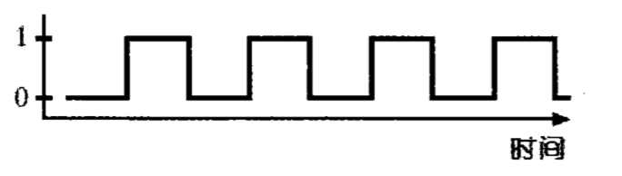
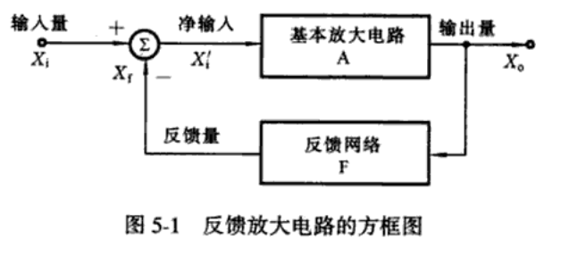
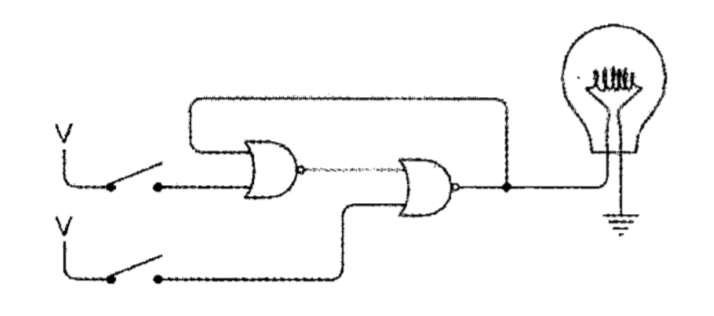
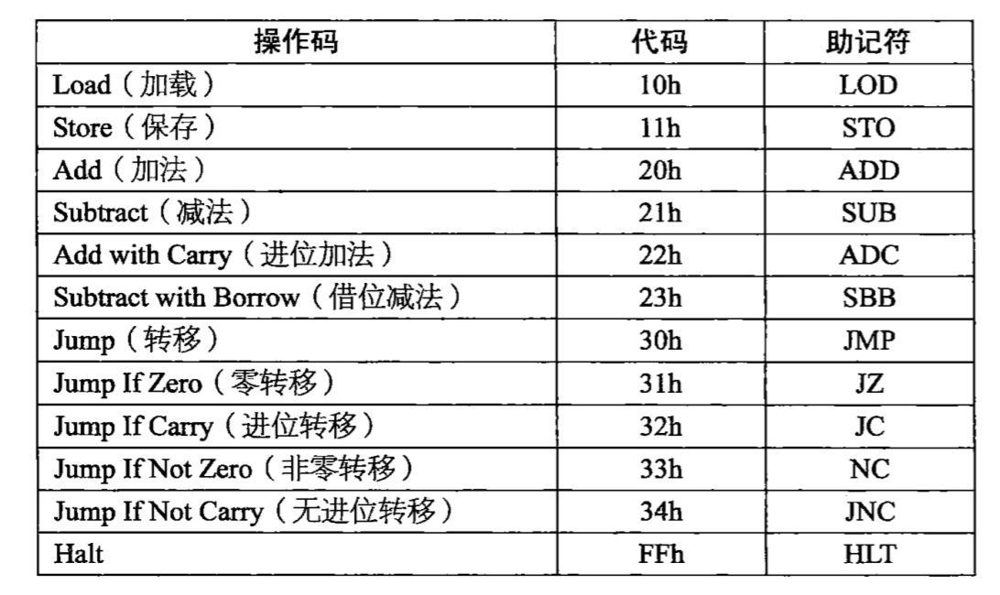
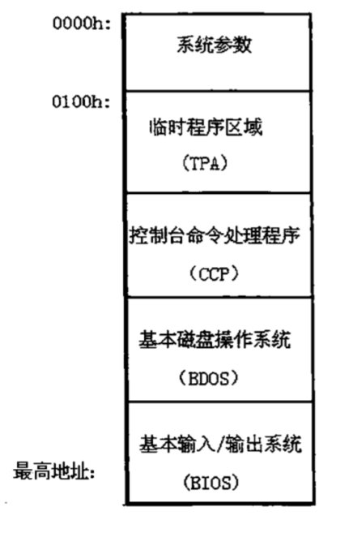

# 读[《编码：隐匿在计算机软硬件背后的语言》](https://book.douban.com/subject/4822685/)


第一次听说这本书，是在今年过年的时候，在 bang 的博客上看到他对这本书的评价非常高，他甚至感叹到，如果学校里能像这本书中讲述方式一样去教学生，那么也就不会有那么多学生是去学习的兴趣了。

后来在金旭亮老师介绍如何自学计算机课程时，他也推荐了这本书，可以作为学习计算机组成原理的入门读物。

因为我是非科班出身，最近开始补计算机课程，这本书便成为了我的第二本教材。


与作为教材的《计算机科学概论》相比，这本书更像是科普读物，以讲故事的形式，深入浅出地讲解了一台计算机是怎么制造出来的以及计算机科学的发展史，是一本绝佳的入门读物，但是如果要更系统、更全面和深入地学习计算机科学，还是需要再看一看专业教材，比如大名鼎鼎的 CSAPP。

一句话概括，这本书值得每个程序员读一读。

## 目录
- 1.编码是什么？
- 2.莫尔斯码的组合与二进制
- 3.从布莱叶盲文中窥探编码的本质
- 4.剖析手电筒
- 5.计算机系统的起源
- 6.电报机和继电器
- 7.位置计数法
- 8.八进制、四进制和二进制
- 9.二进制数
- 10.布尔逻辑运算和电路开关
- 11.逻辑门
- 12.二进制加法器
- 13.如何实现减法
- 14.反馈与触发器
- 15.字节与十六进制
- 16.存储器组织（RAM）
- 17.制作一个计算机实现自动操作
- 18.从算盘到芯片
- 19.两种典型的微处理器
- 20.ASCII 码和字符转换
- 21.总线
- 22.操作系统
- 23.定点数和浮点数
- 24.高级语言与低级语言
- 25.图形化革命


## 1. 编码是什么？

编码是一种用来传递信息的方式，我们使用不同的编码来为我们的交流服务。比如，盲文就是一种编码、电报报文也是一种编码。我们甚至可以说，我们每天说话交流的每一个词汇也是编码，聋哑人用的手语也是一种编码。

在计算机和电子设备中存储和传递文字、音频、图片、视频时，也使用了编码，因为计算机不能像人一样能够用直接通过眼睛、耳朵、嘴巴等方式来接收信息，计算机只认识 0 和 1。不同类型的信息使用了不同的编码。

## 2. 莫尔斯码的组合与二进制

莫尔斯码也被称作二进制码，因为这种编码的组成元素只有两个——“点”和“划”。
也就是说莫尔斯码的每一位只有两种表示，这一点跟二进制数很相似。所以一个莫尔斯码所能表示的数目大小可以用下面的公式表示：

```
码字的数目大小 = 2^编码的位数
```

## 3. 从布莱叶盲文中窥探编码的本质

有一种比莫尔斯码更早的编码方式，叫做布莱叶盲文，是法国的一个盲人布莱叶发明的。

换挡码和逃逸码


## 4. 剖析手电筒

手电筒有一个开关，开关控制电路的中电流是否接通。开关只能是闭合状态或者断开状态。电流只能是有或者无。灯泡也只能是发光或不发光。跟莫尔斯和布莱叶发明的编码中每一位的值一样，只有两种状态。

二进制码和电气电路之间有一定的联系。


## 5. 计算机系统的起源


搭建一个简单的电报系统：通过电线将通讯两方连接起来，接收方有一个灯泡，发送方通过控制灯泡的开关，然后就可以发送摩尔斯编码了。
计算机系统正是基于这个装置构建出来的。


## 6. 电报机和继电器


莫尔斯发明的电报机：发报时通过控制按压电键的时间长短来表示“点”和“划”，收报时通过听声音的长短来区分“点”和“划”。

但是一开始，电报机的有效距离不能太长，于是后来出现了继电器，这个继电器可以将接收到的信息转发出去。

继电器的本质是一个开关，但是这个开关的闭合和断开并不是由人来操纵的，而是由电流控制的。

> 电报机的发明标志着现代通信的开始，人类第一次能够在视线或者听力之外的范围进行实时交流了，而且信息传递的速度更快。
电报的发明使用了二进制码，但是在后来的电子和无线电通信（包括电话、无线电、电视）所使用的通信模式中，二进制码被废弃了，直到后来它又被用在了电脑、光盘、数字影碟、数字卫星电视广播和高清电视上。


**延伸阅读：**

- [电报机_百度百科](https://baike.baidu.com/item/%E7%94%B5%E6%8A%A5%E6%9C%BA/4602383?fr=aladdin)


## 7. 位置计数法


大多数文明都建立在以 10 为基数的数字系统上，因为人们用自己的手指来计数。

早期的数字系统只有罗马数字和阿拉伯数字沿用到了今天，而且今天使用最广泛的就是阿拉伯数字。

阿拉伯数字相比其他计数系统的几个特点：

- 位置计数法
- 没有专门用来表示数字 10 的符号
- 有一个非常重要的符号 0


而位置计数法不仅仅适用于十进制，还适用于其他计数系统，比如八进制、二进制。


## 8. 八进制、四进制和二进制


十进制中，我们用 0~9 这十个符号来表示所有的数字。“十”没有特定的符号，我们用 10 表示“十”。
同样，在八进制中也没有专门表示“八”的符号，我们也是用 10 来表示“八”。

四进制和二进制也是同样的表示方式。

二进制数字系统是最简单的数字系统，它的加法表和乘法表是最简单的。

二进制数字系统在算术和电子技术之间架起了一座桥梁，开关是否打开、电线中是否有电流通过、灯泡是否点亮、电报继电器是否闭合都可以用二进制数 0 和 1 来表示。


大约在 1947 年，美国数学家 John Wilder Turkey 首次用 bit 来表示二进制位 binary digit，一直沿用至今。

**延伸阅读：**

- [Bit - Wikipedia](https://en.wikipedia.org/wiki/Bit)


## 9. 二进制数


### 为什么选择二进制数？

二进制的特殊性：它是最简单的数字系统。

在计算机时代，比特被看做是组成信息块的基本单位。
二进制并不是传达信息的唯一方法，但是比特所传递的“信息量”极小，1 比特是可能存在的最小信息量。
复杂一些的信息可以用多位二进制数来表达。


### 如何用二进制表示信息？

信息本质上是指多个可能性中的一种，而比特本质上就是数字。所以，我们可以说，所有可以被转换成两种或者多种可能性的选择的信息，都可以用比特来表示。比如文字、图片、声音、视频、条形码、评分等等。

用比特表示其他信息的时候，我们所要做的就是计算有多少种可能性，每种可能性对应一个编码。

我们通常所讨论的二进制数，都是指有一定位数的二进制数，比特位越多，所表示的可能性越多。
跟十进制类似，在二进制中，一个二进制数可以表示的编码数目等于 2 的整数次幂，其幂指数就是比特位的位数。

在日常生活中，我们一般是看不到比特的，因为它们深藏于 CD、计算机等电子产品中的编码，但在某些场合还是可以看得到的，比如商品包装上的条形码（UPC）。

在逻辑学中也可以找到比特的影子，逻辑学是哲学和数学的结合，其主要目的就是确定某个陈述是真还是假，而真和假同样可以用 1 和 0 来表示。

## 10. 布尔逻辑运算和电路开关


- 布尔代数
  - 操作对象是集合
  - 运算律
    - 交换律
    - 结合律
    - 分配律
    - 吸收律
    - 互补律
  - 运算符
    - 交集 “x”（相当于 AND）
    - 并集 “+”（相当于 OR）
    - 非 “1-”（相当于 NOT，这里的 1 代表全集）
    - 差集 “-”
  - 两个符号
    - 1 表示全集
    - 0 表示空集

- 将布尔代数和电路相融合，基于此，我们可以设计和制造出利用二进制进行计算的计算机
  - 两个串联的开关相当于 AND
  - 两个并联的开关相当于 OR
  - ...

**延伸阅读**
- [布尔代数 - 维基百科](https://zh.wikipedia.org/wiki/%E5%B8%83%E5%B0%94%E4%BB%A3%E6%95%B0)

## 11. 逻辑门

Claude Elwood Shannon 首次提出了：电子工程师可以运用布尔代数去设计开关电路。

- 什么是逻辑门？
  - 使用串联或并联的**继电器**组合在电路中执行简单的逻辑任务，这种继电器组合就是逻辑门。我们可以将简单的逻辑门组合起来实现更复杂的功能，例如一些简单的算术操作。
  - 我们在这里使用继电器代替了一般的开关，继电器相比开关的优点在于，继电器可以被其他继电器所控制，而不必由人工控制。

- 为什么使用继电器？（第 115 页）
  - 继电器的输入不一定只能是开关，输出也未必只限于灯泡，一个继电器的输出可以连到另一个继电器的输入，这样就可以通过一个继电器自动控制另一个继电器（的“开关”）了
  - 连接继电器是建立逻辑门的关键，这样可以实现将一个逻辑运算结果作为另一个逻辑运算的输入

- 四种基本逻辑门和反向器
  - 与门（AND）
  - 或门（OR）
  - 或非门（NOR）
  - 与非门（NAND）
  - 反向器（非门）

从这里开始，继电器将会极少地出现了，以后的电路会由缓冲器、反向器、四种基本逻辑电路和其他由逻辑门组成的复杂电路组成。当然，所有这些器件也是由继电器构成的。

摩根定律是简化布尔表达式的一种重要手段，可以用来简化电路：
```
非(P 且 Q) = (非 P) 或 (非 Q)
非(P 或 Q) = (非 P) 且 (非 Q)
```

## 12. 二进制加法器

二进制加法跟十进制相似，也是各位数字相加的组合。

二进制加法的加法表比十进制更简单。

+ |  0  |  1
--|-----|-----
0 | 00  | 01
1 | 01  | 10


一对二进制数字相加的结果中有两个数位，其中一个叫做加法位，另一位叫做进位位。所以二进制加法表可以表示成下面这样：

A  |  B  |  加法位 | 进位位
---|-----|--------|--------
0  |  0  |   0    |   0
0  |  1  |   1    |   0
1  |  0  |   1    |   0
1  |  1  |   0    |   1


使用逻辑门制作一个半加器和一个全加器。


## 13. 如何实现减法


### 13.1 减法和加法的本质区别
减法和加法的本质区别是，加法中有进位，而减法中没有进位只有借位，也就是说，减法运算中在计算低位时可能需要向更高一位借位，这样就会导致一位运算变成多位运算了。

举个例子，下面这个加法计算

```
06 + 07 = 13
```

可以拆成两步：
```
// 个位
6 + 7 = 进位 1 和结果 3   

// 十位
(0 + 0) + 进位 1 = 进位 0 和结果 1
```

而下面的减法运算
```
20 - 11 = 9
```

就变成这样了：
```
// 个位
0 - 1 不够，向十位借 1， 10 - 1 = 结果 9 

// 十位
被借走 1 之后，被减数的十位就变了 1
1 - 1 = 结果 0
```


### 13.2 如何让减法计算不涉及借位？


减法表达式：
```

  被减数
-   减数
--------
     差


```

避免借位的关键是保证被减数每一位都比减数中相同位置的数要大，所以我们这里需要用到**对 9 求补数**的概念。

#### （1）减数小于被减数的十进制减法


以 `253 - 176` 为例，为了在计算时不涉及到借位，我们可以将其转成 `(999 - 176) + 253 + 1 - 1000`，就可以得到最终结果了。

步骤：  
- 第一步，求减数对 9 的补数；
- 第二步，将上一步的结果与被减数相加；
- 第三步，将上一步的结果与 1 相加；
- 第四步，将上一步的结果减去 1000；


#### （2）减数大于被减数的十进制减法

以 `176 - 253` 为例，为了在计算时不涉及到借位，我们可以先通过计算 `999 - ((999 - 253) + 176` 得到最终结果的绝对值，然后再取相反数，。

步骤：  
- 第一步，求减数对 9 的补数；
- 第二步，将上一步的结果与被减数相加；
- 第三步，取上一步的结果对 9 的补数；
- 第四步，求上一步的结果的相反数；


#### （3）减数小于被减数的二进制减法


以 `253 - 176` （也就是 `1111 1101 - 1011 0000`）为例，为了在计算时不涉及到借位，我们可以将其转成 `(1111 1111 - 1011 0000) + 1111 1101 + 1 - 1 0000 0000` ，就可以得到最终结果了。

步骤：  
- 第一步，求减数对 1 的补数；
- 第二步，将上一步的结果与被减数相加；
- 第三步，将上一步的结果与 1 相加；
- 第四步，将上一步的结果减去 1 0000 0000；

#### （4）减数大于被减数的二进制减法

以 `176 - 253` （也就是 `1011 0000 - 1111 1101`）为例，为了在计算时不涉及到借位，我们可以先通过计算 `1111 1111 - ((1111 1111 - 1111 1101) + 1011 0000)` 得到结果的绝对值，然后再取相反数，就可以得到最终结果了。

步骤：  
- 第一步，求减数对 1 的补数；
- 第二步，将上一步的结果与被减数相加；
- 第三步，取上一步的结果对 1 的补数；
- 第四步，求上一步的结果的相反数；

### 13.3 负数

- 二进制中负数计算的两个核心问题
  - 如何只用 0 和 1 表示负数
  - 如何很简单地做到将正数和负数用加法法则相加
- 数值表示法
  - 符号数值表示法
  - 补码数值表示法
- 二进制数的两种含义
  - 有符号
  - 无符号
- 为什么在有符号二进制数中，最高位为 1 表示这是一个负数


### 13.4 使用逻辑门制作一个支持减法运算的加法器


## 14. 反馈与触发器


### 14.1 振荡器
振荡器：可以在不需要人为干涉的情况下，完全自发地改变状态。振荡器是用来产生重复电子讯号（通常是正弦波或方波）的电子元件。其构成的电路叫振荡电路。能将直流电转换为具有一定频率交流电信号输出的电子电路或装置。

当采用 0 和 1 的交替序列来表示振荡器的输出时，我们可以用下面的图来描述输出。




### 14.2 反馈和触发器


#### （1）反馈

反馈就是将电子系统中输出回路的输出量(输出电压或输出电流)的一部分或全部，通过一定的电路(反馈网络)反向送回到输入端或输入回路，进而对输入量产生影响的连接形式(过程)。





#### （2）触发器


触发器（Flip Flop）是一种可以存储电路状态的电子元件。最简单的是由两个或非门，两个输入端和两个输出端组成的RS触发器。

触发器的电路图由逻辑门组合而成，其结构均由R-S锁存器派生而来（广义的触发器包括锁存器）。触发器可以处理输入、输出信号和时钟频率之间的相互影响。


### 延伸阅读
- [振荡器（电子元件）百度百科](https://baike.baidu.com/item/%E6%8C%AF%E8%8D%A1%E5%99%A8/15486394)
- [模拟电子技术 - 朱定华, 吴建新, 饶志强 - Google 图书](https://books.google.co.uk/books?id=1rd-WTBmga4C&pg=PA116&lpg=PA116&dq=%E4%BB%80%E4%B9%88%E6%98%AF%E5%8F%8D%E9%A6%88+++%E7%94%B5%E8%B7%AF&source=bl&ots=pmxGsaBHuU&sig=PSkte004fDwL8VU3Ouy6WiZ6G_Q&hl=zh-CN&sa=X&redir_esc=y#v=onepage&q&f=false)
- [触发器（数字电路领域术语）百度百科](https://baike.baidu.com/item/%E8%A7%A6%E5%8F%91%E5%99%A8/193146)


## 15. 字节与十六进制

### 15.1 字节

- 什么是字节
  - 字节就是 byte，一个字节相当于 8 位（bit）
- 字节的来历
  - 1956 年左右首次由 IBM 提出，20 世纪 60 年代中叶，开始用来表示一组 8 bit 的数据
- 字节的特点
 - 可以表示 256 种事物

### 15.2 十六进制

- 使用八进制来表示字节：3 位八进制数字表示一个字节
  - 八进制和二进制之间的转换
- 十六进制相比八进制的优势
  - 可以等分单个字节
- 十六进制的一些特点
  - 有 16 种符号来表示一位，也就是从 0 到 F
- 二进制、十六进制和十进制之间的转换
- 十六进制的加法运算和负数的表示

#### 延伸阅读
- [Byte - Wikipedia](https://en.wikipedia.org/wiki/Byte)

## 16. 存储器组织（RAM）


- 一个触发器可以存储 1 位信息，如果要存储 2 位， 3 位或者更多位信息的话，该怎么办呢？
  - 答案就是通过组合多个 1 位锁存器来实现可存储 8 个独立比特位的 RAM。RAM 也就是随机访问存储器，又叫做读/写存储器。
- 存储器是可以保存信息。读/写存储器既可以在每个锁存器中存储新的数据，又可以检查每个锁存器中存了什么数据。
- 读/写存储器又被称为随机访问存储器的原因是，读写操作很自由，我们只需要改变地址及相关的输入，就可以从锁存器中读取或写入需要的数据，而不需要逐个顺序读取。
- 几个数据存储相关的单位
  - KB（2^10 个字节，约等于 1000 个字节）
  - MB（2^20 个字节，也就是 1024 KB，约等于 10^6 个字节）
  - GB（2^30 个字节，也就是 1024 MB，约等于 10^9 个字节）
  - TB（2^40 个字节，也就是 1024 GB，约等于 10^12 个字节）

- 存储器的一个问题
  - 如果没有电，RAM 中存储的数据就会全部丢失
  - 因此，随机访问存储器又被称为易失性存储器


## 17. 制作一个计算机实现自动操作

- 前面章节中实现的加法器仅仅只是一个单任务系统，在它的第一个版本中只是把 RAM 地址中的内容加到称为累加器的 8 位锁存器中
- 设计一个能做以下四件事的自动加法器
  - 加载
  - 累加计算
  - 存储结果
  - 停止自动加法器
- 一些概念
  - 指令码/操作码
  - 进位加法
  - 借位减法
  - 取指令
  - 执行指令
  - 条件跳转
  - 计算机：能执行条件跳转指令、重复操作或者循环
    - 数字计算机
      - 处理器：其中包括算术逻辑单元（ALU）
      - 存储器
      - 输入设备
      - 输出设备
  - 软件和硬件
  - 编码
- 机器码/机器语言
- 汇编语言





## 18. 从算盘到芯片


- 这一章主要介绍了计算机硬件（严格来讲是处理器的核心部件）的发展历史：
  - 20 世纪 30 年代：使用继电器的机电化计算机
  - 20 世界 40 年代：使用真空管的电子计算机
  - 20 世界 50 年代：使用晶体管的电子计算机
  - 20 世界 60 年代：使用集成电路（也就是芯片，IC）的电子计算机
- 冯·诺依曼体系架构
- 摩尔定律
- 两大 IC 家族
  - TTL
  - CMOS
- 第一块“计算机芯片”（又叫“微处理器”）——Intel 4004 芯片
  - 什么是微处理器：将计算机中央处理器的所有构成组件整合在一起，集成在一个芯片上
- 比较微处理器性能的三个衡量标准
  - 数据位宽，比如 32 位处理器比 4 位处理器的处理速度更快
  - 最大时钟频率
  - 可寻址存储器的最大空间

## 19. 两种典型的微处理器

这一章主要是通过观察微处理器和外部设备的交互过程，来认识其内部的结构和工作原理。这里作者将微处理器看做一个黑盒，主要的研究方法是通过观测芯片的输入、输出信号。特别是芯片的指令集来理解微处理器的工作原理。

- 两种典型的微处理器
  - 8080 和 6800 
- 堆栈的概念
  - 特点：后进先出
  - push 和 pop 操作
  - 堆栈的实现
    - 堆栈其实就是一段普通的 RAM 存储空间，这段空间相对独立不另做他用。8080 微处理器设置了一个专门的 16 位寄存器对这段存储空间寻址，这个特殊的寄存器成为堆栈指针。
- 子程序
  - 子程序是一段频繁使用的完成特定功能的代码。对于汇编语言来说，子程序是其最基本的组成部分。
- Call 指令和 Return 指令
  - Call 指令用于执行子程序，Return 指令用于子程序结束后返回之前执行 Call 指令的跳转点。
  - 执行 Call 指令后，程序计数器加载一个新的地址来执行子程序中的代码，而处理器会把原来 Call 指令下一条指令的地址保存到堆栈中，待子程序执行到最后，再执行 Return 指令，从堆栈中弹出两个字节，也就是处理器跳转前保存的地址，并把它们加载到程序计数器中，这样就完成了子程序的调用，之后程序将继续执行 Call 指令后面的指令。
- 微处理器如何与外围设备通信？
  - 外围设备配备了与存储器类似的接口，微处理器通过与某种外围设备对应的特定地址（即接口）对其进行读写操作。


## 20. ASCII 码和字符转换

- 要想在数字计算机上处理信息，就必须把它们按位存储。
- 字符编码和字符编码集
  - 为了将文本表示为数字形式，我们需要构建一种系统来为每一个字符赋予一个唯一的编码。具有这种功能的系统被称为字符编码集，系统内的每个独立编码被称为字符编码。
- 编码系统中一个编码需要多少比特？
  - 取决于这个编码系统中有多少个字符，比如 8 位的编码系统支持的字符个数不大于 2^8，也就是 256 个
- ASIIC 编码
  - ASCII 码是美国制定的一个国家标准，ASCII 码是 7 位编码，它的二进制取值范围时 0000000~1111111
  - 现在，8 位的字节存储已经作为了一项标准，尽管 ASCII 码从技术的本质上来看是 7 位编码，但仍以 8 位的形式存储
  - ASCII 码的缺点：只适用于美国
- Unicode 编码
  - Unicode 编码一种全世界通用的编码系统
  - Unicode 采用了 16 位编码，每一个字符需要 2 个字节，也就是说 Unicode编码范围为 0000h~FFFFh，总共可以表示 65,536 个不同的字符
  - Unicode 的前 128 个字符与 ASCII 码一致
  - Unicode 的问题：改变了“一个字符对应一个字节”的字符存储空间等价关系，为了使编码系统兼容，Unicode在存储空间上付出了相应的代价

### 延伸阅读
- [字符编码笔记：ASCII，Unicode 和 UTF-8 - 阮一峰的网络日志](http://www.ruanyifeng.com/blog/2007/10/ascii_unicode_and_utf-8.html)


## 21. 总线

- 什么是总线
  - 总线（Bus）是计算机各种功能部件之间传送信息的公共通信干线，它是由导线组成的传输线束。总线是一种内部结构，它是cpu、内存、输入、输出设备传递信息的公用通道，主机的各个部件通过总线相连接，外部设备通过相应的接口电路再与总线相连接，从而形成了计算机硬件系统。
  - 按照计算机所传输的信号种类，计算机的总线可以划分为以下三类
    - **数据总线**：数据总线传输输入输出信号，用于在 CPU 与存储器、I/O接口设备 之间来回传送需要处理或是需要储存的数据。数据总线上的信息是双向传输的。
    - **地址总线**：地址总线上传送地址信号，主要用来指定需要访问的部件（如存储器单元、外设）。总线主设备发出地址信号后，总线上的所有部件均感受到该地址信号，但只有经过译码电路选中的部件才接收主设备的控制信号，并与之通信。地址总线是单向的，即地址信号只能由总线主设备至从设备。
      - 在总线上所连接的各类设备，按其对总线有无控制功能可分为主设备和从设备。主设备对总线有控制权，从设备只能响应主设备发来的总线命令。这样，总线上所有的信息传输都是由主设备启动的。
    - **控制总线**：控制总线主要用来传送控制信号和时序信号。控制信号中，有的是微处理器送往存储器和输入输出设备接口电路的，如读/写信号，片选信号、中断响应信号等；也有是其它部件反馈给CPU的。
  - 数据总线、地址总线和控制总线是如何一起工作的？
    - 当地址总线在传输与 CPU 通信的部件的地址信息时，数据总线同时也在传输真正要被处理的数据，而控制总线就会传输来自 CPU 的命令，同时接收来自那些与 CPU 通信的部件返回的状态信号。
  - 从广义上讲，总线不仅是一组信号线，总线是一组传送线路及相关的总线协议。
- 总线的发展历程
- 主板
- 计算机上各部件是如何工作的
  - CPU
  - RAM
  - 三态
    - 三态是指除了 0 和 1 之外，数据输出信号还有第三种状态。三态输出对总线的操作至关重要，几乎所有连接在总线上的器件都使用由总线传递而来的数据输入信号，但不管何时，连接在总线上的电路板中只有一个能确定总线数据输入信号的类型，其他电路板处于三种状态中的无效状态。
  - 输出设备——显示器
    - CRT 视频显示器
    - 视频适配器/显卡
    - 屏幕显示图像的原理
      - 水平回归
      - 垂直回归
    - 隔行扫描技术
    - 扫描信号
      - 垂直同步脉冲
      - 水平同步脉冲
    - 像素
    - 视频适配器中配置了 RAM，用于存储要显示的内容，微处理器也会向此 RAM 写入数据以更新屏幕上要显示的内容
    - 字符是如何在显示器上显示的？
      - 先计算每个字符所用的像素数
      - 每个字符都被定义为一个 7 位的 ASCII 码
      - 假设每个字符需要 8x8 的网格，也就是 64 个像素，则分辨率为320x200 的显示器能显示（25行x40个/行）个字符，因此显示一屏的字符需要占用的 RAM 空间大小为 1000x7 bit，约为 1024 byte，也就是 1 KB
    - 字符生成器（ROM）
    - 光标
    - 最早的视频分辨率标准：640x480
  - 输入设备——键盘
    - 键盘扫描码
    - 中断信号
  - 外部设备
    - 打孔卡片
    - 磁带
    - 磁介质存储器（磁盘）
      - 软盘
      - 硬盘
    - 磁盘存储器和随机访问存储器的区别


#### 延伸阅读
- [总线 - 百度百科](https://baike.baidu.com/item/%E6%80%BB%E7%BA%BF)
- [Bus(computing) - Wikipedia](https://en.wikipedia.org/wiki/Bus_(computing))
- [Address bus - Wikipedia](https://en.wikipedia.org/wiki/Address_bus)
- [Control bus - Wikipedia](https://en.wikipedia.org/wiki/Control_bus)（推荐阅读）
- [计算机组成原理 系统总线——数据通信 - 中科大课件](http://staff.ustc.edu.cn/~llxx/cod/courseware/11_bus.pdf)（推荐阅读）
- [数据总线, 地址总线, 控制总线详解. - 雅思敏 - 博客园](https://www.cnblogs.com/yasmi/articles/5195847.html)
- [iOS 保持界面流畅的技巧](https://blog.ibireme.com/2015/11/12/smooth_user_interfaces_for_ios/)（推荐阅读）
- [存储知识课堂（一）：磁盘工作原理揭秘-存储专区](http://storage.it168.com/a2011/1209/1286/000001286396_all.shtml)

## 22. 操作系统

- 没有操作系统（软件），计算机就无法完成任何有意义的工作
- 键盘处理程序和命令处理程序
  - 按下按键时，就会产生一个中断信号送至微处理器，计算机内有中断控制芯片，通过执行一条 RST 指令使得微处理器响应这次中断。假如是 RST 1 指令，微处理器执行这条指令，把当前程序计数器的值压入到堆栈中，然后跳转到地址0008h处。可以直接在这片地址空间上输入一些代码（使用控制面板），这些代码称为键盘处理程序
  - 当键盘处理程序对“Retun”或“Enter”键（对应的ASCII码是ODh）进行处理时它把视频显示器内存中的这一行文本解释为计算机的一条命令（ command），换言之，键盘处理程序的任务是执行此命令。实际上，在键盘处理程序内含有一个命令处理程序，它可以解释三条命令：W 命令、D 命令和 R 命令。
- 文件系统
  - 文件系统是磁盘存储的一种方法，就是把数据组织成文件。简单地说，文件是相关数据的集合，占用磁盘上一或多个扇区。更重要的是，你可以为每个文件命名，这有助于记下文件里存放的内容。想象一下，磁盘是不是类似于一个文件柜，每个文件都有个小标签，标签上有文件的名称。
- 操作系统是什么？
  - 操作系统是许多软件构成的庞大程序集合，文件系统就是其中的部分。前面讲到的键盘处理程序和命令处理程序最终也能经过拓展，演变成为操作系统。
- 操作系统又是如何工作的呢？（以最早的 CP/M 系统为例）
  - 磁盘最开始的两个磁道存储 CPM 系统本身，而CPM在磁盘上是无法运行的，必须将其加载到内存里。只读存储器（ROM）在CPM计算机中使用得并不多，只需要用它来存放一小段称为引导程序（ bootstrap loader，因为这段代码可以通这段代码的自举操作来高效地引导操作系统的其余部分）。开机启动时，磁盘上最开始的128字节的扇区内容，会首先由引导程序加载到内存并运行，这个扇区包含有特定的代码，可以把CPM中的其余部分加载到内存中，整个过程称为操作系统的引导（ booting）
  - 操作系统的引导过程完成后，随机存储器(RAM)的最高地址区域用来存放CP/M,加载完CPM后，整个内存空间的组织结构如下图所示。
  - CPM 的三个组成部分
    - 控制台命令处理程序（CCP）
    - 基本磁盘操作系统（BDOS）
    - 基本输入输出系统（BIOS）
  - 从上面的介绍，我们可以看到操作系统的是哪个主要功能
    - 利用命令和实用程序操作文件
    - 将程序加载到内存中运行
    - 提供 API 让程序能够方便地访问硬件
- DOS 系统
- UNIX 系统和 Linux 系统
- 多任务操作系统
  - 内存管理
  - 虚拟内存
- 大型的图形化操作系统
  - Macintosh 系统
  - Windows 系统 





## 23. 定点数和浮点数

- 计算机中的一切数据都是以位的形式存储的，也就是说所有的数据都表示为二进制形式。
- 小数
  - 定点
    - “定点”是指小数点的位置总是在数的某个特定位置。
    - 得注意的是，有关小数点位置的计数信息并没有与整个数字一起存储。所以，使用定点小数的程序必须知道小数点的位置。
    - 如果可以确定程序用到的数字不会大到超过预定的存储空间，并且这些数的小数位不会很多，那么使用定点格式的小数将是一个很好的选择。在表示非常大或非常小的数时，使用定点格式数是绝对不合适的。
  - 科学计数法
    - 科学计数法把每个数表示成有效位与 10 的幂的乘积的形式，这样可以避免写一长串的 0，因此适合表示极大或极小的数
    - 采用科学计数法表示的数可以分成两部分
      - 指数部分
      - 有效数部分
  - 浮点数（基于科学计数法）
    - 单精度（4个字节）
    - 双精度（8个字节）


## 24. 高级语言与低级语言

- 低级语言
  - 机器语言
  - 汇编语言
    - 汇编器
  - 低级语言的特点
- 高级语言
  - FORTAN
  - ALGOL
  - COBOL
  - PL/I
  - BASIC
  - Pascal
  - Ada
  - C
  - 面向对象程序设计语言
  - 高级语言的特点

## 25. 图形化革命

- 图形用户界面
- 鼠标
- Macintosh 系统
- 图形格式
  - 矢量图
  - 栅格图
- Internet 和 Web


## 延伸阅读

- 《计算机是怎样跑起来的》
- 《程序是怎样跑起来的》
- 《计算机科学概论》
- 《深入理解计算机系统》


------------------

完成本笔记工计耗时约 5 天，平均 5 章/天。

2018.11.13 零点 上海·新泾镇
