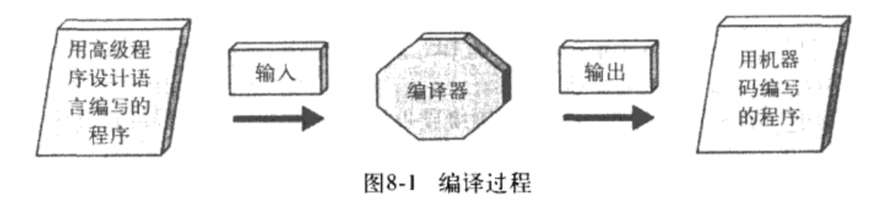
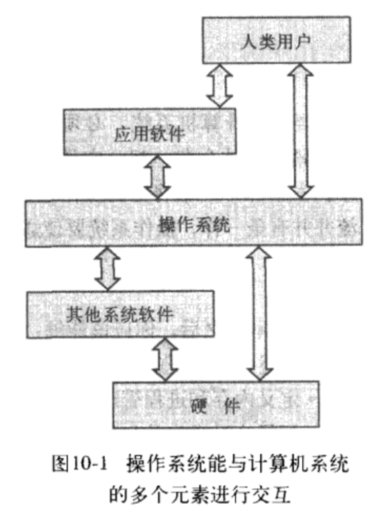
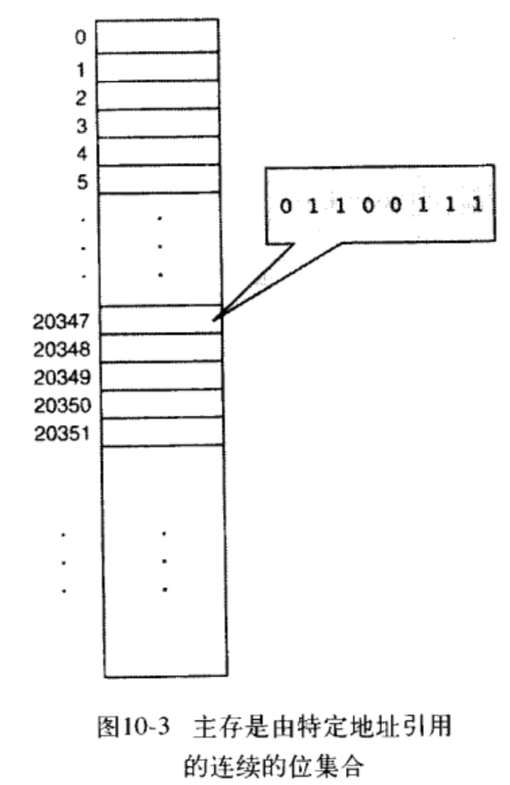
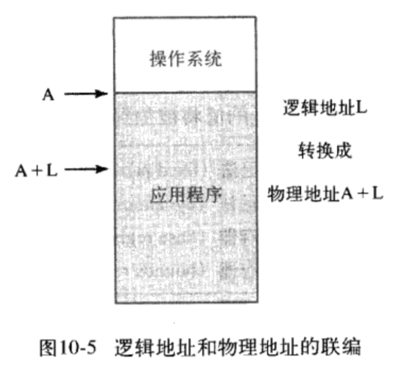
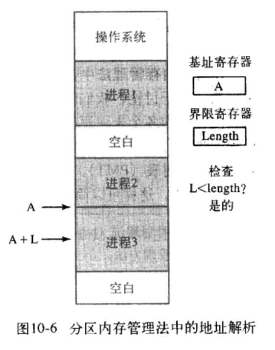
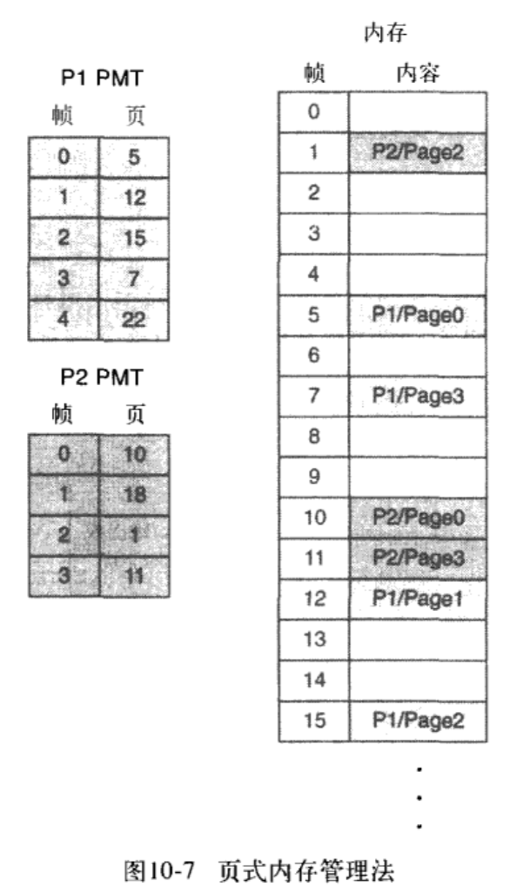
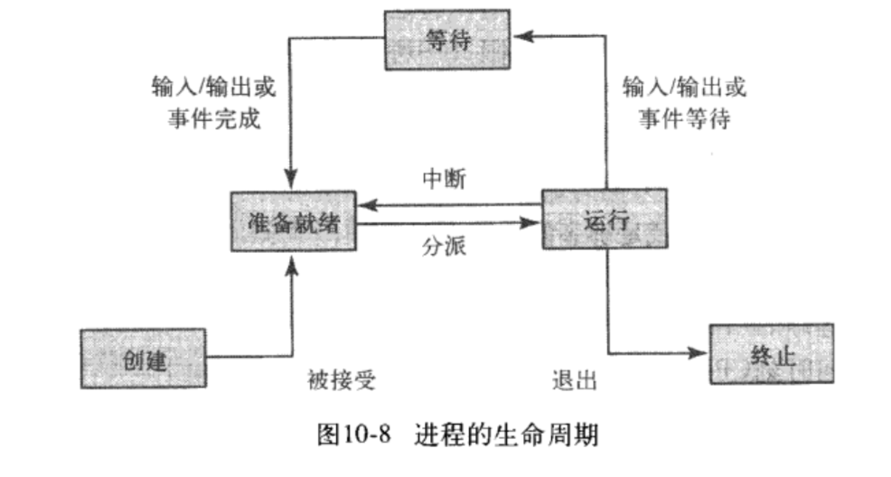
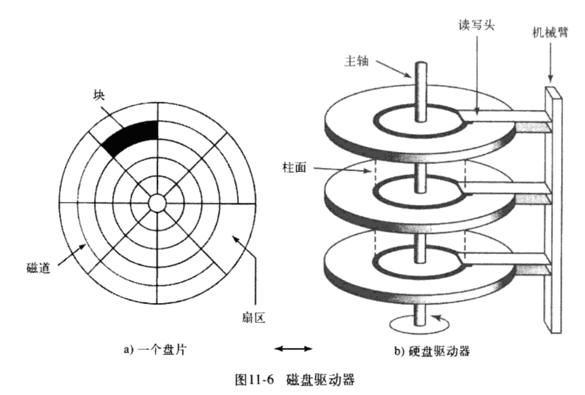

# 读《计算机科学概论》

**关键词**：抽象、概览、分层、计算

## 简介
作者将计算机系统分成信息层、硬件层、程序设计层、操作系统层、应用程序层和通信层这 6 个层，以自底向上，从内到外，从具体到抽象的方式介绍了计算机如何运作，它们可以做什么以及如何使用它解决问题，最后还探讨了计算机的局限，也就是它不能做什么。

通过阅读这本书，我们可以知道，从普通用户的角度来看，我们现在所使用的计算机是怎么实现的，从应用程序开发者的角度来看，我们平常开发时所用的语言和框架都处在哪一层、跟其它层有什么关系。我们会从细节中脱离出来，退后一步看到更大的世界。

读完这本书，你会/应该知道：        
- 计算机系统可以分为哪几层
- 计算机科学包括哪些领域
- 在计算机的世界里，抽象意味着什么
- 计算机系统的发展历史
- 从代码变成可执行的程序再到程序运行这一过程发生了什么
- 计算机能干什么，以及不能干什么

**阅读建议**：有一定的预备知识和编程经验

## 目录

- 第一部分 基础篇
  - 第 1 章 全景图
- 第二部分 信息层
  - 第 2 章 二进制值和记数系统
  - 第 3 章 数据表示法
- 第三部分 硬件层
  - 第 4 章 门和电路
  - 第 5 章 计算部件
- 第四部分 程序设计层
  - 第 6 章 问题求解和算法设计
  - 第 7 章 低级程序设计语言
  - 第 8 章 高级程序设计语言
  - 第 9 章 抽象数据类型和算法
- 第五部分 操作系统层
  - 第 10 章 操作系统
  - 第 11 章 文件系统和目录
- 第六部分 应用程序层
  - 第 12 章 信息系统
  - 第 13 章 人工智能
  - 第 14 章 模拟、图形学和其他应用程序
- 第七部分 通信层
  - 第 15 章 网络
  - 第 16 章 万维网
- 第八部分 总结
  - 第 17 章 计算的限制

-----------

## 第一部分 基础篇

### 第 1 章 全景图

#### 1. 计算系统
- 什么是计算系统：计算系统不是计算机系统，计算机是一种设备，而计算系统是一种动态实体，用于解决问题以及与它所处的环境进行交互
  - 硬件
  - 软件
  - 数据
- 计算系统的分层
  - 信息：计算机上的信息都是通过二进制来表示的
  - 硬件：由计算机系统的物理硬件（门和电路、专用元件）组成
  - 程序设计：负责处理软件、用于实现计算的指令以及管理数据，程序是解决问题的工具
  - 操作系统：管理计算机的资源，管理硬件设备、程序和数据间的交互方式
  - 应用程序：用计算机解决真实世界的问题
  - 通信：计算机连接到网络上，可以共享信息和资源，网络让计算机不再孤立
- 我们很容易掌握细节，但却失去了全局观念，所以在阅读这本书的过程中，请记住计算系统的全景图
- 抽象，抽象与计算的关系
  - 抽象是一种思考问题的方式，它删除或隐藏了复杂的细节
  - 人在同一时间所关注的事物是有限的，通过抽象，我们只需要关注一些必需的信息，忽略无关紧要的细节
  - 抽象是计算的关键，计算系统的分层表现了抽象的概念
  - 例子
    - 开汽车
    - 抽象艺术

#### 2. 计算的历史
- 硬件
  - 早期历史（Before 1951）
    - 算盘
    - 分析机
    - UNIVAC I
  - 第一代（1951~1959）
    - 存储元件：**真空管**
    - 主存储器：磁鼓
    - 外围设备
      - 输入设备：读卡机、磁带驱动器
      - 输出设备：穿孔卡片
      - 辅助存储设备：磁带（顺序存储）
  - 第二代（1959~1965）
    - 存储元件：**晶体管**
    - 主存储器：磁芯（能够即时访问信息）
    - 辅助存储设备：磁盘
  - 第三代（1965~1971）
    - 主要特征：**集成电路（IC）**
    - 带有键盘和鼠标的输入/输出设备：终端
    - 摩尔定律：一个集成电路板上能够容纳的电路的数量每年增长一倍
  - 第四代（1971~？）
    - 主要特征：**大规模集成化**
    - 摩尔定律：一个集成电路板上能够容纳的电路的数量每 18 个月增长一倍
    - 出现了个人计算机
    - 工作站
    - 并行计算
    - 连网
- 软件
  - 关键点
    - 计算机的用户角色的转变和分化
    - 系统程序员和应用程序员
  - 时间线
    - 第一代（1951~1959）
      - 机器语言
      - 汇编语言
      - 汇编器：将汇编语言翻译成机器语言
      - 出现了系统程序员，也就是编写辅助工具的程序设计员
    - 第二代（1959~1965）
      - 高级语言
        - FORTRAN
        - COBOL
        - Lisp
      - 编译器：将高级语言翻译成汇编语言后，再由汇编语言翻译成机器语言
      - 系统程序员的角色变得更加明显
        - 系统程序员：编写汇编器、编译器这些工具
        - 应用程序设计员：使用工具编写程序
    - 第三代（1965~1971）
      - 出现了操作系统，控制计算机资源，操作系统就是一种决定何时运行什么程序的程序
      - 实用程序、操作系统和语言翻译程序共同构成了系统软件
      - 分时
      - 计算机用户的概念出现了，他们不再是传统意义上的程序员
    - 第四代（1971~1989）
      - 结构化程序设计方法
        - Pascal
        - BASIC
        - C、C++
      - 更强大的操作系统
        - UNIX
        - PC-DOS
        - MS-DOS
        - Macintosh（引入了鼠标和点击式的图形界面，彻底改变了人机交互）
    - 第五代（1990~今天）
      - 微软的崛起
      - 面向对象程序设计
        - Java 开始成为主流
      - 万维网（World Wide Web）的出现
      - 每个人都成为了计算机用户

#### 3. 计算工具和计算学科

- 计算学科分区
  - 系统分区：构建计算工具
    - 算法和数据结构
    - 程序设计语言
    - （计算机）体系结构
    - 操作系统
    - 软件方法学和工程学
    - 人机交互
  - 应用分区：把计算机作为工具
    - 数值和符号计算
    - 数据库和信息检索
    - 人工智能和机器人技术
    - 图形学
    - 组织信息学
    - 生物信息学

> 在第一部分中，作者强调了抽象的重要性，另外，计算系统和编程语言的分层理论，以及这里没有提到的计算机网络分层，再加上程序员角色的分化，让我联想到金旭亮老师提到的学习方法——我们实际上只需要深入了解 N-1 层和 N+1 层就够了，其他层跟我们日常工作关系不大，先有了“全景图”，可以等到需要时再去深入了解其它层的细节。

## 第二部分 信息层

### 第 2 章 二进制数值和记数系统
#### 1. 数字和计算

- 所有使用计算机存储和管理的信息类型最终都是以数字形式存储的，也就是说，在计算上存储和传输的信息都是数字 0 和 1。
- 数字的分类
  - 有理数
    - 整数
      - 自然数
      - 负数
    - 实数
  - 无理数

#### 2. 位置记数法
- 基数：规定一个记数系统使用的数字量，比如，二进制的基数就是 2，所以二进制只能用 0 和 1 表示
- 位置计数法
- 二进制、八进制和十六进制是相关的，因为它们的基数都是 2 的幂
- 进制转换
- 二进制数值和计算机
  - 现代计算机中，所有的信息都是用二进制数值表示的，原因在于计算机中的每个存储位只有高电压和低电压两种信号
  - 每个存储单元成为一个二进制数字（或者称作“位”），把 8 个“位”组合在一起就构成了字节，字节组合在一起就构成了字。
  - 字中的位数成为计算机的字长。比如，半字（2字节或16位）、全字（4字节或32位）

### 第 3 章 数据表示法

#### 1. 数据和计算机

计算机能够处理的信息包括：         
- 数字
- 文本
- 音频
- 图像和图形
- 视频

这些数据最终都被存储为二进制数字，每个文档、图像和广播讲话都将被表示为由 0 和 1 组成的字符串。

数据压缩：      
- 什么是数据压缩
- 为什么要压缩数据
- 压缩率
- 有损压缩和无损压缩

模拟数据和数字数据  
- 数据可以分为两类
  - 模拟数据
  - 数字数据    
- 自然界的大部分都是连续的和无限的，而计算机是有限的。因此计算机不能很好滴处理模拟数据，我们需要数字化数据，并用二进制表示。
  - 什么是数字化？
    - 把连续的信息分割成多个片段，并提取其中的关键片段
  - 为什么用二进制而不是十进制或者其他记数系统呢？
    - 因为如果存储和管理数据的设备只需要表示两种数字化之一，那么费用要小得多，而且也可靠得多。另外，如果电信号只传输二进制数据，也易于维护。

二进制表示法    
- 二进制的固有特性：一个位只能是 0 或 1，没有其他的可能，因此，一个位只能表示两种状态之一
- 如果要表示多于两种状态，就需要多个位，n 位二进制数字能表示 2^n 种状态

#### 2. 数字数据的表示法

- 负数表示法
  - 符号数值表示法
  - **补码数值表示法**
    - 如何理解“可以通过取反加 1 得到一个二进制数的负数”？
    - 溢出
- 实数表示法
  - 十进制浮点表示法
  - 二进制浮点表示法
  - 进制转换
  - 科学计数法

十进制补码表示法示意图如下：

二进制补码表示法示意图如下：

#### 3. 文本表示法

- 如何表示字符：赋予每个字符一个二进制字符串
- 字符集
  - ASCII 字符集
  - Unicode 字符集
  - 文本压缩
    - 关键字编码
    - 行程长度编码
    - 赫夫曼编码

#### 4. 音频信息表示法

- 声音的原理
- 数字化声波
- 音频格式
  - MP3 
  - WAV

#### 5. 图像和图形的表示法

- 颜色表示法
  - RGB 和 ARGB
  - 色深度：表示颜色的位数
    - 增强彩色（16位）
    - 真彩色（24位）
- 数字化图像和图形
  - 图像的数字化：像素和分辨率
  - 图像表示法
    - 光栅图形格式（位图，bitmap）
      - GIF
      - JPEG
      - PNG
    - 矢量图形表示法
      - Flash
      - SVG

#### 6. 视频表示法

- 视频信息的数字化
- 视频压缩（视频编译码器）
  - 时间压缩
  - 空间压缩
- 视频编译码器
  - MPEG
  - Real Video

> 读这一部分两个最大的收获就是，一是知道了从文本到图片、音视频这么多种形式的信息是怎么表示的，有了一个全面的了解；另一个意外发现就是知道补码原来是这么回事，原来十进制也有补码数值表示法。

## 第三部分 硬件层

### 第 4 章 门和电路

#### 1. 计算机和电学

- 计算机是电子设备，它的大多数基础硬件元件控制着电流。
- 任何电信号都有电压电平，我们根据信号的电压电平区分信号的值（0 或 1）。
- 门：对电信号执行基本运算的设备，一个门接收一个或多个输入信号，生成一个输出信号
- 电路：**由门组合而成**，可以执行复杂的任务，比如执行算数运算和存储值。
- 描述门和电路的表示法：
  - 布尔表达式
  - 逻辑框图
  - 真值表

#### 2. 门

- 6 种基本类型的门
  - 非（NOT）门
  - 与（AND）门
  - 或（OR）门
  - 异或（XOR）门
  - 与非（NAND）门
  - 或非（NOR）门

#### 3. 门的构造

- 门的构造：门使用**晶体管**建立输入值和输出值之间的映射
- 晶体管
  - 晶体管由半导体材料制作而成，半导体是一种既不是良好的导体也不是绝缘体的材料
  - 晶体管可以扮演的角色有两种，既可以做传导电流的电线，又可以做组织电流的电阻器，输入信号的电压电平决定了晶体管的角色。
  - 晶体管只能是开（生成高电压输出）或关（生成低电压输出）两种状态，由基极电信号决定。
- 如何用晶体管构造门（见示意图）

#### 4. 电路

- 电路
  - 组合电路：输入值明确决定了输出值
  - 时序电路：输出是输入值和电路现有状态的函数，因此，时序电路通常涉及信息存储
- 组合电路：把一个门的输出作为另一个门的输入，就可以把门组合成电路
- 布尔代数的一些属性
  - 交换律
  - 结合律
  - 分配律
  - 恒等
  - 余式
  - 德·摩根定律
    - `(A x B)' = A' + B'`
    - `(A + B)' = A' x B'`
- 加法器：计算机中最基本的加法运算是由专门电路加法器执行的
  - 半加器：计算两个数位的和并生成正确进位的电路，比如计算 `1 + 1 = 10` 就需要半加器电路
    - 二进制的加法运算结果包括两部分：和与进位，所以，半加器有两条输出线（见示意图）
      - 和对应的是异或门
      - 进位对应的是与门
  - 半加器不会把进位输入考虑在计算之内，所以半加器只能计算两个数位的和（比如 `1 + 1 = 10`），而不能计算两个多位二进制的和（比如 `11 + 01 = 100`）。
  - 全加器：计算两个数位的和，并考虑进位输入值的电路
- 多路复用器：使用一些输入控制信号决定用哪条输入数据线发送输出信号的电路
  - 用通俗的话来讲，多路复用器就是把n个输入排列组合的结果分别输出到 2^n 个不同的输出线路（见示意图）
  - 多路复用器可以有任意多条输入线和相应的控制线。一般来讲，n 条输入控制线的二进制值决定了选择 2^n 条数据线中的哪一条作为输出
- 多路分配器

电路逻辑框图：

半加器逻辑框图：  

半加器逻真值表：  

全加器逻辑框图和真值表：

多路复用器框图：

多路复用器真值表：

#### 5. 存储器电路

- 时序电路可以用来作为存储器
- 存储器电路的特点：电路的输出信号被当做电路的输入信号，也就是说，电路的下一个状态部分是由当前状态决定的
- S-R 锁存器
  - 如何将一个值存入 S-R 锁存器？

#### 6. 集成电路

- 集成电路（芯片，IC）是嵌入了多个门的硅片。
- 集成电路是根据它们包含的门数目来分类的
  - 小规模集成（门数：1~10）
  - 中规模集成（门数：10~100）
  - 大规模集成（门数：100~100 000）
  - 超大规模集成（门数：多于 100 000）

#### 7. CPU 芯片

- 计算机中最重要的集成电路就是中央处理器（CPU）
- CPU 是一种具有输入线和输出线的高级电路
- 每个 CPU 芯片有大量的引脚，计算机系统的所有通信都是通过这些引脚完成的。这些通信把 CPU 和本身也是高级电路的存储器和 I/O 设备连接在一起。

#### 小结：

这一章我们讨论了计算机如何通过控制最底层的**电流**进行运算，由于我们讨论的是使用**二进制**信息的数字计算机，所以我们只关注两个电压范围，分别表示为二进制数字1或0，电流由称为**门**的电子设备操纵，门负责执行基本的逻辑运算，如非运算，与运算和或运算。门是由一个成多个**晶体管**创建的，晶体管的发明使计算学发生了翻天覆地的变化。 

把一个们的输出作为另一个门的输人，可以把门组合成**电路**，仔细设计这些电路，可以创建出能执行更复杂任务（如求和，多路复用和存储数据）的没备，门的集合，或者说完整的电路，常常被嵌入在一个**集成电路（或芯片）**中，这引出了**中央处理器**的概念，

### 第 5 章 计算部件

#### 1. 独立的计算机部件

- 如何看懂一个计算机广告中的术语、配置参数
  - 处理器速度
  - 内存大小
  - 硬盘大小
  - 显示器像素
  - ...

#### 2. 存储程序的概念——冯·诺伊曼体系结构

- 冯·诺伊曼体系结构：当代计算机设计的理论基础
  - 冯·诺伊曼体系结构是一种将程序指令存储器和数据存储器合并在一起的计算机设计概念结构。
  - 主要特征
    - 数据和指令可以存储在一起
    - 处理信息的部件和存储信息的部件是独立的
  - 定义了计算机组成部分
    - 内存：存放数据和指令
    - 算术逻辑部件(ALU)：执行算术和逻辑运算
      - 寄存器：CPU 上的一小块存储区域，用于存储中间值或特殊数据。
    - 输入设备：把数据从外界输入到计算机中
    - 输出设备：把数据从计算机中输出到外界
    - 控制器：掌管着读取-执行周期，控制其他部件的动作，从而执行指令序列的计算机部件。
      - 指令存储器：存放当前执行的指令的寄存器
      - 程序计数器：存放下一条要执行的指令的寄存器
      - 中央处理器（CPU）：算术逻辑部件和控制器的组合，是计算机用于解释和执行指令的“大脑”。
      - 总线：把机器的主要组成部分连接在一起的一组电线，数据通过总线在计算机中传递
      - 主板：个人计算机中的主电路板
  - 延伸阅读：[冯·诺伊曼结构 - 维基百科](https://zh.wikipedia.org/wiki/%E5%86%AF%C2%B7%E8%AF%BA%E4%BC%8A%E6%9B%BC%E7%BB%93%E6%9E%84)、[冯·诺依曼体系结构 - 百度百科](https://baike.baidu.com/item/%E5%86%AF%C2%B7%E8%AF%BA%E4%BE%9D%E6%9B%BC%E4%BD%93%E7%B3%BB%E7%BB%93%E6%9E%84/4690854?fromtitle=%E5%86%AF%E8%AF%BA%E4%BE%9D%E6%9B%BC%E4%BD%93%E7%B3%BB%E7%BB%93%E6%9E%84&fromid=213926)
- 读取-执行周期
  - 根据冯诺伊曼的理论，数据和指令都存储在内存中，以同样的方式处理，也就是说数据和指令都是可以编址的。
  - 指令存储在连续的内存区域中，它们操作的数据存储在另一块内存区域中。
  - 要启动读取-执行周期，第一条指令的地址被装入程序计数器，处理周期中的步骤如下：
    - 从内存中读取指令
    - 译解指令
    - 如果需要，获取数据
    - 执行指令
- RAM 和 ROM
  - ROM 要解决的问题是：RAM 中的数据可以随便读写，但是随意地更改程序代价很高
  - RAM：随机存取存储器，可读可写；存储在其中的数据可更改；关闭电源后，RAM 不再保留它的位配置
  - ROM：只读存储器，只读；存储在其中的数据不可更改；关闭电源后，ROM 会保留它的位配置，它的位组合是永久性的，所以用它存储计算机启动自身需要的指令
- 二级存储设备：在计算机不运行的时候保存数据
  - 磁带
  - 磁盘
    - 硬盘
    - 软盘
  - CD、DVD
- 触摸屏：一种外围设备，同时具备输入输出功能
  - 电阻触摸屏
  - 电容触摸屏
  - 红外触摸屏
  - 声表面波触摸屏

冯·诺伊曼体系结构：

总线：

读取-执行周期：

#### 3. 非冯·诺伊曼体系结构

- 并行处理系统：处理器不止一个，能够进行并行计算，从而加速处理过程
  - 同步处理
  - 流水线操作
  - 共享内存配置

## 第四部分 程序设计层

### 第 6 章 问题求解和算法设计

#### 1. 问题求解

- 计算机与问题求解
  - 首先要知道有些问题计算机可以解决，而另外一些问题是计算机不能解决的
  - 如果不告诉计算机做什么，它什么也做不了，它**不能自己分析问题并提出问题的解决方案**。所以必须靠人（程序员）去分析这些问题，并为解决问题开发指令集（程序），然后让计算机执行这些指令。
  - 如果计算机不能自己解决问题，那么计算机还有什么用呢？其实，只要为计算机编写了解决方案，它就能够对不同的情况和数据快速一致地反复执行这个方案，它**把人们从枯燥重复的任务中解放了出来**
- 如何解决问题（Polya 问题求解策略）
  - 第一步，必须理解问题
  - 第二步，寻找相同或相似的问题，看看是否已经有可供参考的解决方案，然后用分治法解决。
    - 永远不要彻底重新做一件事，如果解决方案已经存在了，直接用这种方案就可以了。
  - 第三步，测试方案
  - 第四步，分析得到的解决方案
- 分治法和抽象
  - 大问题是子问题的抽象，子问题是大问题的具体化

#### 2. 算法

- 算法是什么
  - 在计算领域，算法是指在有限的时间内用有限的数据解决问题或子问题的明确指令集合
  - 用通俗的话理解，算法就是解决问题的步骤
- 计算领域的问题求解过程
  - 分析和说明阶段：理解、分析问题
  - 算法开发阶段：设计解决方案和“预演”
  - 实现阶段：编码和测试验证，也就是把解决方案转换成计算机能够执行的形式
  - 维护阶段：使用程序、修改程序，不断修正
- 设计算法的两种方法（这两种方法都是基于分治策略的）
  - 自顶向下设计（又称功能分解）
  - 面向对象设计（OOD）

#### 3. 伪代码

- 伪代码：它不是代码，它是用来表示算法的语言，属于抽象层面的语言。伪代码并非一种计算机语言，而更像一种人们用来说明操作的便捷语言。
- 语言层包围着真正的机器。虽然伪代码并没有特定的语法规则，但必须要表示出下面的概念：
  - 变量
  - 赋值
  - 输入/输出
  - 重复（迭代、循环）
  - `if-then` 选择
  - `if-then-else` 选择

#### 4. 两种设计方法
- 自顶向下
  - 自顶向下设计：把问题分解成一套子问题，然后再继续分解子问题。这一过程将一直持续到每个子问题足够基础，不再需要进一步分解为止。
    - 我们创造了一种分层结所来表示问题和子问题（称为模块）之间的关系，这种结构也称为**树形结构**，在树形结构中，每一层中的模块都可以调用下层模块的服务，这些模块是算法的基本构件
    - 把问题分解成子问题、模块或者片段的目的，是要独立地解决每个模块
  - 设计算法的过程：写下主要步骤，它们将成为主要模块。然后开始开发第一层模块中的主要步骤的细节。如果还不知道如何解决一个步骤，或者觉得细节问题很棘手，那么给这个模块起一个名字，继续开发下一个模块。之后，可以把这个名字扩展成低级的模块。这个过程将在多个层次中重复，把每个任务扩展成最小的细节。需要扩展的步骤是**抽象步骤**，不需要扩展的步骤是**具体步骤**。如果一个任务困难繁重，可以把它的细节推到较低层次中。这一过程也可以应用到棘手的子任务上。**整个问题最终将被分解成能够解决的单元**。
  - 编写自顶向下的设计方案与编写论文的大纲相似，这种解决问题的方法在生活中也很常见。（注：在《把时间当作朋友》和《软技能：代码之外的求生指南》中也都提到了通过拆分任务来解决大问题的）
- 面向对象
  - 面向对象设计：是用叫做**对象**的独立实体生成解决方案的问题求解方法
  - 对象：由数据和处理数据的操作构成
  - 面向对象设计的重点是对象以及它们在问题中的交互作用

> 解决计算机问题的着手点是先问自己如果要手动地解决这个问题该怎么解决。因为如果我们不能手动地处理一个任务，那对这个任务的理解就不够透彻，不足以编写算法。通常，手动解决方案是计算机解决方案的雏形。

#### 5. 几个重要思想
- 信息隐蔽（延迟细节设计）：高层设计隐蔽了细节，对于每个特定的分层，设计者只考虑与之相关的细节
- 抽象：信息隐蔽是隐藏细节的做法，而抽象是隐藏细节后的结果，抽象是复杂系统的一种模型，只包括对观察者来说必需的细节
  - 在算法设计中，高层的模块是它下面的模块的抽象
- 事物命名
- 程序设计语言
  - 用程序设计语言编写的指令能够被翻译层计算机可以直接执行的指令
  - 程序设计语言是一种人造语言，由符号、专用字和一套规则组成，用于构造程序，也就是表示成计算机能够理解的指令序列
  - 程序设计语言由两部分组成：
    - 语法：规定了如何组织语言中的指令
    - 语义：赋予了每条指令的含义
- 测试

> 抽象是人们用来处理复杂食物的最强有力的工具。

### 第 7 章 低级程序设计语言

#### 1. 计算机操作

- 不论是表示算法的所有符号，还是用于实现算法的程序设计语言，都必须反映出计算机能够执行的操作类型
- 计算机最基本的 5 种操作类型
  - 存储
  - 检索
  - 处理
  - 输入
  - 输出

#### 2. 抽象的分层

根据编程语言的发展历程，从硬件附带的语言——机器语言，到低级程序设计语言——汇编语言，再到高级程序设计语言，每前进一个阶段，语言自身就变得越抽象，也就是说，一个语句所包含的处理变得越来越复杂。

#### 3. 机器语言
- 机器语言：由计算机直接使用的二进制编码指令构成的语言
- 计算机指令是如何表示的？
  - 每种处理器都有自己专用的机器指令集合。这些指令
是处理器唯一真正能够执行的指令。由于指令的数量有限，所以处理器的设计者就列出所有
的指令，给每个指令分配一个二进制代码，用来表示它们。这与第3章中介绍的表示字符数
据的方法相似。
- 处理器是如何识别指令的呢？
  - CPU 的电子器件本来就能够识别专用
命令的二进制表示，因此,计算机必须参考的命令的真实清单并不存在。CPU 把这个清单嵌
入了自己的设计。
- 机器语言指令是如何被执行的呢？
  - 每条机器语言指令只能执行一个非常低级的任务。在机器语言中,处理过程中每一个微
小的步骤都必须明确地编码。即使是求两个数的和这样的小任务,也需要三条用二进制编写
的指令。程序员必须记住每组二进制数对应的是什么指令。如第1章所述,机器语言的程序员
必须对数字很敏感,而且非常注意细节。
- 虚拟计算机
  - 主要特性和构造
  - 指令格式：`指令 = 指令说明符 + 操作数说明符`
  - 编写机器指令
  - 执行过程
- 示例程序

#### 4. 汇编语言

- 汇编语言是一种低级语言，用助记码表示特定计算机的机器语言指令

#### 5. 其他重要思想

### 第 8 章 高级程序设计语言

#### 1. 翻译过程
- 编译器：把用高级语言编写的程序翻译成机器码的程序。
  - 任何计算机只要具有一种高级语言的编译器,就能运行用这种语言编写的程序。注意,编译器是一种程序,因此,要编译一个程序,就必须具有这个编译器在特定机器上的机器码版本。想要在多种类型的机器上使用一种高级语言,就要具备这种语言的多个编译器。
- 解释器：输入用高级语言编写的程序,指导计算机执行每个语句指定的动作的程序。
  - 解释器是一种翻译程序,用于解释和执行语句序列。 
  - 与汇编器和编译器只是输出机器码不同的是,解释器在翻译过语句之后会立即执行这个语句。可以把解释器看作编写程序所使用的语言的模拟器或虚拟机。
  - Java 和字节码
    - 由于软件解释器非常复杂,所以用要解释的语言编写的程序通常比要编译的程序的运行速度慢很多 因此,要编译的语言发展成了主流,以致产生了Java。
    - 在Java的设计中,可移植性是最重要的特性。为了达到最佳可移植性,Java将被编译成一种标准机器语言一**字节码**。
    - 怎么会存在标准机器语言呢?
      - 字节码(bytecode)：编译Java源代码使用的标准机器语言
      - 一种名为 **JVM（Java虚拟机）**的软件解释器将接收字节码程序,然后执行它。也就是说,字节码不是某个特定硬件处理器的机器语言,任何县有JVM的机器都可以运行编译过的Java程序。
    - **注意：**标准化的高级语言实现的可移植性与把Java程序翻译成字节码然后在JVM上解释它所实现的可移植性是不同的。
      - 用高级语言编写的程序能够在任何具有适合的编译器的机器上编译和运行,程序将被翻译成计算机能够直接执行的机器码。而Java程序则是被编译成字节码,编译过的字节码程序可以在任何具有JVM解释器的机器上运行。也就是说,Java编译器输出的程序将被解释,而不是被执行。Java程序总是被翻译成字节码。

#### 2. 编程范式
- 命令式
  - 结构化
    - 过程式：顺序执行，代表语言有 Basic、Fortran、C、Pascal
    - 面向对象：Smalltalk
  - 非结构化
    - COBOL
- 声明式
  - 函数式：Lisp、Scheme
  - 逻辑式：Prolog

#### 3. 命令式语言的特性
- 布尔表达式
- 强类型化：大多数高级语言在关联内存单元和标识符时，要求说明这些内存单元存储的数据类型，如果程序中的某个语句要把类型不符的值存入一个变量,就会出现错误消息,只有类型相符
的值才能存入变量
  - 数据类型
    - 为什么需要数据类型？
      - 数据是表示信息的物理符号。在计算机内部,数据和指令都是二进制位的组合。计算机能够执行一条指令,是因为这条指令的地址被载入了程序计数器,指令被载入了指令寄存器。被执行的位组合同样可以表示整数、实数、字符或布尔值,关键看**计算机如何解释位组合**
    - 数据类型可以分为两大类
      - 简单数据类型
        - 整数
        - 实数
        - 字符
        - 布尔值
      - 复合数据类型
        - 字符串
  - 声明：把变量、动作或语言中的其他实体与标识符关联起来的语句,使程序员可以通过名字引用这些项目。
- 输入/输出结构
  - 字符流和数据类型转换
- 控制结构
  - 顺序执行
  - 选择语句
  - 循环语句
    - 计数控制
    - 事件控制
  - 子程序语句（函数/方法）
    - 返回值
    - 参数传递
    - 参数传递方式
      - 值参：由调用部件传入实参的副本的形参
      - 引用参数：由调用部件传入实参的地址的形参
  - 递归
    - 基本情况
    - 一般情况
  - 异步处理
  - 嵌套逻辑
- 复合数据类型
  - 记录（结构体）->异构项目的集合
  - 数组 -> 同构项目的集合

#### 4. 面向对象语言的特性
- 封装：实施信息隐蔽的特性，目的是为了控制对细节的访问
- 继承：可以从一个已有的类，派生出一个具有相同属性和方法的类，然后可以向这个新的类中添加一些自己特有的属性和方法
- 多态：不同的子类中的同名方法具有不同的实现

**延伸阅读：**      
- [编程语言 - Wikipedia](https://zh.wikipedia.org/wiki/%E7%BC%96%E7%A8%8B%E8%AF%AD%E8%A8%80)

### 第 9 章 抽象数据类型和算法

#### 1. 抽象数据类型
- 抽象数据类型的定义
- 三个层次
  - 应用层
  - 逻辑层
  - 实现层
- 容器

#### 2. 算法的实现
- 基于数组的实现
- 链式实现

#### 3. 列表
- 三个特征
  - 同构
  - 线性
  - 变长

#### 4. 排序
- 选择排序
- 冒泡排序
- 快速排序（分而治之）

#### 5.  二分查找法
- 前提：有序

#### 6. 栈和队列
- 栈（LIFO）
- 队列（FIFO）

#### 7. 树和图（非线性数据类型）
- 树
  - 二叉树
  - 二叉查找树：任何节点的值大于左子树节点的值，小于右子树节点的值
  - 二叉树的遍历
- 图
  - 有向图和无向图

#### 8. 标准库
- 很多语言的标准库中已经实现了一些现成的算法，我们不需要重复造轮子

**延伸阅读：**      
- [抽象数据类型 - 维基百科](https://zh.wikipedia.org/wiki/%E6%8A%BD%E8%B1%A1%E8%B3%87%E6%96%99%E5%9E%8B%E5%88%A5)

## 第五部分 操作系统层

### 第 10 章 操作系统

#### 1. 操作系统的角色
                      
- 操作系统：管理计算机资源并为系统交互提供界面的系统软件。
- 操作系统的角色
  - 计算机的操作系统把硬件和软件紧密地结合在一起,它是其他软件依附的基础,井且允许我们编写与机器进行交互的程序。就像交警要使通过十字路口的车流井井有条一样,操作系统要使通过计算机系统的程序流井然有序。
  - 现代软件一般分为两类
    - 应用软件：是为了满足特定需要一解决真实世界中的问题而编写的。文字处理程序、游戏、库存控制系统、汽车诊断程序和导弹控制程序都是应用软件。
    - 系统软件：负责在基础层上管理计算机系统的软件。它为创建和运行应用软件提供了工具和环境。系统软件通常直接与硬件交互，提供的功能比硬件自身提供的更多。计算机的操作系统是系统软件的核心。操作系统负责管理计算机的资源(如内存和输入/输出设备)，并提供人机交互的界面。其他系统软件则支持特定的目的，如在屏幕上绘制图像的图形软件的库。
  - 操作系统的各种角色通常都围绕着一个中心思想“良好的共享”。操作系统负责管理计算机的资源，而**这些资源通常是由使用它们的程序共享的**。多个并发执行的程序将共享主存，依次使用CPU，竞争使用输入/输出设备的机会。操作系统将担任现场监视器，确保每个程序都能够得到执行的机会。
- **内存、进程和 CPU 管理**
  - **多道程序设计**（multiprogramming）：是一种在主存中同时驻留多个程序的技术，这些程序为了能够执行，将竞争 CPU 资源，所有现代操作系统都采用置程序设计技术。
  - **内存管理**：因为在主存中可能同时驻留多个程序，所以操作系统必须执行内存管理，以明确内存中有哪些程序，以及它们驻留在内存的什么位置。
  - **进程**：可以将它定义为正在执行的程序。程序只是一套静态指令，进程则是动态的实体，表示正在执行的程序。
  - **进程管理**：因为在多道程序设计系统中，可能同时其有多个活动进程。操作系统必须仔细管理这些进程。无论何时，下一条要执行的都是一条明确的指令，中间值将被计算出来。在执行过程中，进程可能会被打断，因此操作系统还要执行**进程管理**，以跟踪进程的进展以及所有中间状态。
  - **CPU 调度**：内存管理和进程管理都需要 CPU 调度，CPU 调度就是确定某个时刻 CPU 要执行内存中的哪个进程。
  - 记住，操作系统自身也是必须执行的程序。
- 批处理
  - 在早期的系统中，批处理是指操作员把来自多个用户的作业组织成分批，一个分批包含一组需要相同或相似资源的作业，操作员从而不必反复地载入和准备相同的资源。
  - 现代操作系统中的批处理概念，是允许用户把一系列 OS 命令定义为一个批文件，以控制一个大型程序或一组交互程序的处理。例如，Windows 中具有 `.bat` 后缀的文件就源自于批控制文件的想法，它们存放的是系统命令。类似于 Unix 中的Shell脚本。
  - 延伸阅读：[批处理 - 维基百科](https://zh.wikipedia.org/wiki/%E6%89%B9%E5%A4%84%E7%90%86)
- 分时操作
  - 分时系统(timesharing): 如何更大程度地利用机器的能力和速度的问题引出了**分时**的概念。分时系统允许多个用户同时与计算机进行交互。多道程序设计法允许同时有多个活动进程，从而给了程序员直接与计算机系统交互，且仍然共享资源的能力。分时系统创建了每个用户都专有这台计算机的假象。操作系统负责在幕后管理资源 (包括CPU) 共享。
  - 分时的原理：每个用户由主机上运行的一一个登录进程表示。当用户运行程序时，将创建另一个进程(由用户的登录进程生成)。CPU 时间由所有用户创建的所有进程共享。每个进程将顺次得到一小段 CPU 时间。前提是CPU足够快，能够处理多个用户的请求并不使任何用户发现自己在等待。事实上，分时系统的用户有时会发现系统响应减慢了，这是由活动用户的数量和 CPU 的能力决定的。也就是说，当系统负荷过重时，每个用户的机器看来都变慢了。
- 其他
  - **网络**
  - 设备驱动程序
  - 实时系统

  

#### 2. 内存管理

- 主存：所有程序在执行时都存储在主存中。 这些程序引用的数据也都存储在主存中，以便程序能够访问它们。可以把主存看作一个大块的连续空间，这个空间被分成个被分成了 8 位、16 位或 32 位的小组。主存中的每个字节或字有一个对应的地址，这个地址只是一个整数，唯一标识了内存中的一个特定部分。（如下图所示）
- 程序是怎样被加载到内存中的？
- 操作系统如何管理程序内存
  - 跟踪一个程序驻留在内存中的什么位置以及如何驻留的
  - 把逻辑程序地址转换成实际的内存地址
    - 程序中到处都是对变量的引用和对程序其他部分的引用。在编译程序时，对标识符（如变量名）的引用将被转化为逻辑地址。当程序最终被载入内存时，每个逻辑地址将被转换成对应的物理地址。
      - **逻辑地址**（又称虚拟地址或相对地址）：是对一个存储值的引用，是相对于引用它的程序的地址。
      - **物理地址**：主存储设备中的真实地址。
      - **地址联编**：指逻辑地址和物理地址间的映射。
- 几种不同的内存管理方式
  - 单块内存管理
    - 原理：首先把主存分成两部分，操作系统占用一部分，另一部分分配给应用程序。当加载应用程序时，我们把整个应用程序载入一大块连续的内存区域，除了操作系统外，一次只能处理一个程序。进行地址联编所要做的只是把操作系统的地址考虑在内。
    - 优缺点：实现和管理起来非常简单，但却大大浪费了内存空间和 CPU 时间。应用程序一般不可能需要操作系统剩余的所有空间，而且在程序等待某些资源的时候，还会浪费 CPU 时间。
  - 分区内存管理
    - 原理：为了能同时在内存中驻留多个应用程序，内存不再被分成两个部分，有两种划分内存的方法——固定分区法和动态分区法。无论是固定分区还是动态分区，任何时候内存都是
 被划分为一组分区，有些是空的，有些分配给了程序。
      - 固定分区法：主存被划分成特定数目的分区，这些分区的大小不一定相同，但在操作系统初始引导时它们的大小就固定了。
      - 动态分区法：根据程序的需要创建分区。初始时，主存将被看作一一个大的空白分区。当载入程序时，将从主存划分出一块刚好能容纳程序的空间，留下一块新的、小一些的空白分区，以便之后供其他程序使用。操作系统将维护一个分区信息表，不过在动态分区中，地址信息会随着程序的载入和清除而改变。
    - 优缺点：可以同时把多个程序载入内存，从而更高效地利用主存。但是一个分区的大小必须要能够容纳整个程序，所以如果程序太大而主存可用空间较小，那就无法加载大程序了。
  - 页式内存管理
    - 原理：主存被分成小的大小固定的存储块，叫做**帧**。进程将被划分为**页**，为了便于讨论，我们假设页的大小等于帧的大小。在程序执行时，进程的页将被载入分散在内存中的各个未使用的帧中，因此，一个进程的页可能是四处散落的、无序的，与其他进程的页混合在一起。 为了掌握进程页的分布，操作系统需要为内存中的每个进程维护一个独立的**页映射表**(PMT)， 把每个页映射到载入它的帧（如下图所示）。注意，页和帧都从0开始编号的，这样可以简化地址的计算。
      - **请求分页**：页式内存管理法的扩展，只有当页面被引用（请求）时才会被载入内存。任何时刻 CPU 都只访问进程中的一个页面，此时，进程中的其他页面是否在内存中无关紧要。
      - **页面交换**：在请求分页法中，页面经过要求才会被载入内存。也就是说，当引用一个页面时，首先要看它是否已经在内存中了，如果该页面在内存中，就可以直接访问，否则，要从二级存储设备把这个页面载入可用的帧，然后再完成访问。从二级存储设备载入页面通常会引发把其他页面写回二级存储设备，这种行为叫做页面交换。
      - **虚拟内存**：由于整个程序不必同时处于内存而造成的程序大小没有限制的假象。
    - 优缺点：
      - 优点：相比前面的所有内存管理法中，整个进程都必须作为整体载入内存。因此，进程大小始终有一个上限，而页式内存管理中的请求分页法消除了这一限制。
      - 缺点：不过，虚拟内存在程序执行时需要很多开销。以前，一旦程序载入了内存，就完全处于内存中，准备好执行了。采用虚拟内存法，则经常需要在主存和二级存储设备间进行页面交换。当一个进程等待页面交换时，另一个进程接管 CPU 的控制，那么这种开销是可以接受的。但页面交换过多就会造成**系统颠簸**，会严重降低系统的性能。
        - 系统颠簸(thrashing): 频繁的页面交换造成的低效处理。

主存中的内存地址：

单块内存管理：

分区内存管理：

页式内存管理：

#### 3. 进程管理

- 进程的几种状态
  - 创建
  - 准备就绪
  - 运行
  - 等待
  - 终止
- 进程控制块（PCB）
  - 操作系统必须为每个活动进程管理大量的数据,这些通常存储在称为进程控制块的数据结构中。
  - 通常，每个状态由一个PCB列表表示,处于该状态的每个进程对应一个PCB。当进程从一个状态转移到另一个状态时,它对应的PCB也会从一个状态的列表中转移到另一个状态的列表。新的PCB是在最初创建进程(新状态)的时候创建的,将一直保持到进程终止。
  - PCB存储了有关进程的各种信息,包括程序计数器的当前值(说明了进程中下一条要执行的指令)。PCB还存储了进程在其他所有CPU寄存器中的值。
  - 上下文切换：每当一个进程进入了运行状态,当前正在运行的进程的寄存器值将被存入它的PCB,新运行的进程的寄存器值将被载入CPU。这种信息交换叫做上下文切换。

#### 4. CPU 调度

- CPU 调度：所谓CPU调度，就是确定把哪个处于准备就绪状态的进程移入运行状态。也就是说CPU调度算法将决定把 CPU 给予哪个进程，以便它能够运行。
  - 抢先调度：当当前执行的进程自愿放弃了CPU时发生的CPU调度
  - 非抢先调度：当操作系统决定照顾另一个进程,抢占当前执行进程的CPU资源时发生的CPU调度
- 调度方法
  - 先到先服务（非抢先的）：给予最早到达的作业优先权。
  - 最短作业优先（非抢先的）：给予运行时间最短的作业优先权。
  - 循环调度法（一种抢先调度）：让每个活动进程轮流使用 CPU，每个进程得到一个小时间片。

### 第 11 章 文件系统和目录

#### 1. 文件系统

- 最常见的二级存储设备是磁盘驱动器。
- 基本概念
  - 文件：磁盘上的数据都在储在文件中,这是在电子媒介上组织数据的一种机制。所谓文件,就是**相关数据的有名集合**。从用户的角度来看,文件是**可以写入二级存储设备的最小信息量**。用文件组织所有信息,呈现出一个统一的信息存储视图。
  - 文件系统：文件系统是操作系统提供的一个逻辑视图，使用户能够按照文件集合的方式管理数据。文件系统通常用目录组织文件。
  - 目录：文件的有名分组。
- 文件中存的是什么？
  - `文件 = 数据 + 数据的组织方式`
- 根据文件数据的组织方式，所有文件都可以被归为两类：文本文件和二进制文件
  - 文本文件：其中的数据字节是 ASCII 或 Unicode 字符集中的字符。比如 `.py` 文本文件。
  - 二进制文件：包含特定格式的数据的文件，要求给位串一个特定的解释。比如 png 格式的图片文件。
- 文件类型
  - 文件类型：文件中包含的信息的种类叫做文件类型。
  - 文件扩展名：文件名通常由两部分组成，即主文件名和文件扩展名。文件扩展名说明了文件的类型。
  - 注意：文件扩展名只说明了文件中存放的是什么，改变扩展名不会改变文件中的数据或它的内部格式。
- 文件操作
  - 创建和删除文件
    - 准备工作：操作系统用两种方式跟踪二级存储设备。它维护了一个表以说明哪些内存块是空的(也就是说可用的)，还为每个目录维护了一个表，以记录该目录下的文件的信息。
    - 创建文件：要创建一个文件，操作系统需要先在文件系统中为文件内容找一块可用空间，然后把该文件的条目加人正确的目录表中，记录文件的名字和位置。
    - 删除文件：要删除一个文件，操作系统要声明该文件使用的空间现在是空的了，并要删除目录表中的相应条目。
  - 读写文件
    - 打开和关闭文件：大多数操作系统要求，在对文件执行读写操作前要先打开该文件。操作系统维护了一个记录当前打开的文件的小表，以避免每次执行项操作都在大的文件系统中检索文件。当文件不再使用时，要关闭它，操作系统会删除打开的文件表中的相应条目。无论何时，一个打开的文件都有一个当前文件指针(一个地址)，说明下一次读写操作要发生在什么位置。”有些系统还为文件分别设置了读指针和写指针。
    - 读文件：所谓读文件，是操作系统提交文件中从当前文件指针开始的信息的副本。发生读操作后，文件指针将被更新。
    - 写文件：写信息是把指定的信息记录到由当前文件指针所指的文件空间中，然后更新文件指针。
    - 通常，操作系统允许用户打开文件以便进行写操作或读操作，但不允许同时进行这两项操作。
  - 重定位文件中的当前文件指针：打开的文件的当前指针可以被重定位到文件中的其他位置，以备下一次读或写操作。
  - 把数据附加到文件结尾：在文件结尾附加信息要求把文件指针重定位到文件的结尾，然后再写入相应的数据。
  - 删减文件：有时，删除文件中的信息是很有用的。所谓删减文件，是删除文件的内容，但不删除文件表中的管理条目。提供这项操作是为了避免删除一个文件，然后又重新创建它。有时，删减操作非常复杂，可以删除从当前文件指针到文件结尾的文件内容。
  - 重命名文件：更改文件名的操作
  - 复制文件：创建一个文件内容的完整副本并给该副本一个新名字
- 文件访问
  - 顺序访问法：以线性方式访问文件中的数据的方法。
  - 直接访问法：通过指定记录编号直接访问文件中的数据的方法。
  - 说明：任何类型的介质都可以存储这两种类型的文件。文件访问方法定义了重定位当前文件指针的方法。它们与存储文件的设备的物理限制无关。
- 文件保护
  - 文件保护机制决定了谁可以使用文件，以及为什么目的而使用文件。
  - 比如，Unix 系统下，文件保护设置有三类，即 Owner、Group 和 World，在每种类别下，你可以决定一个文件是可读的、可写的还是可执行的。
  - 控制文件的访问，以防止蓄意获取不正当访问的企图，以及最小化那些由于用户不经意引起的问题。

#### 2. 目录

- 什么是目录
  - 目录的本质是文件：大多数操作系统都用文件表示目录。目录文件存放的是关于目录中的其他文件的数据。
- 创建和操作目录
  - 建立文件目录
  - 列出目录下的所有文件
  - 在目录中创建、删除和重命名文件
  - 在目录中查找文件
- 目录树
  - 目录树：展示文件系统的嵌套目录组织的结构。
  - 根目录：包含其他所有目录的最高层目录。
  - 工作目录：当前活动的子目录。
- 路径名
  - 路径：要用文本指定一个特定的文件,必须说明该文件的路径,即找到这个文件必须历经的系列目录。路径可以是绝对的,也可以是相对的。
  - 绝对路径：从根目录开始,包括所有后继子目录的路径。
  - 相对路径：从当前工作目录开始的路径。

#### 3. 磁盘调度

- 背景：CPU和主存的速度都比二级存储设备的数据传输速度快很多。这就是为什么一个进程要执行磁盘IO操作,在等待信息传输的同时把使用CPU的机会让给另一个进程
的原因。由于二级IO是一般计算机系统中最慢的部分,所以访问磁盘驱动器上的信息的方法对于文件系统至关重要。
- 磁盘调度：在计算机同时处理多个进程时,将建立一个访问磁盘的请求列表。操作系统用于决定先满足哪个请求的方法叫做磁盘调度。
- 磁盘驱动器读取数据的原理
  - 磁盘驱动器被组织得像一叠盘片,每个盘片被分为几个磁道,每个磁道又被分为几个扇区。所有盘片上对应的磁道构成了柱面。（如下图所示）
  - 对我们的讨论来说,最重要的一点是在任意时刻都有一组读写头在所有盘片的特定柱面上盘旋。记住,寻道时间是读写头到达指定柱面所花费的时间。等待时间是盘片旋转到正确的位置以便能读写信息所花费的时间。在这两个时间中,寻道时间的要求更高,因此它是磁盘调度算法处理的重点。
- 几种磁盘调度算法
  - 先到先服务磁盘调度法
  - 最短寻道时间优先磁盘调度法
  - SCAN 磁盘调度法

## 第六部分 应用程序层

### 第 12 章 信息系统

#### 1. 信息管理

- 数据和信息的关系
- 信息系统：帮助用户组织和管理数据的应用软件。
  - 电子制表软件
  - 数据库管理系统

#### 2. 电子制表软件

- 电子制表软件是用单元格来组织数据和计算新值的公式的应用软件。比如微软的 Excel。

#### 3. 数据库管理系统

- 数据库：结构化的数据集合。
- 数据库管理系统：由物理数据库、数据库引擎和数据库模式构成的软件和数据的组合。
- 数据库管理系统一般由下列几部分构成
  - 物理数据库：存放数据的文件的集合。
  - 数据库引擎：支持对数据库内容的访问和修改的软件。
  - 数据库模式：存储在数据库中的数据的逻辑结构的规约。
- 关系模型
  - 关系模型是目前最常见的一种数据库模型
  - 在关系DBMS中,用表组织数据项和它们之间的关系。表是记录的集合。记录是字段的集合。每个表会被指派一个(或一组)键,键的值唯一标识了表中的每个记录。
  - 一些概念
    - 表（table）：数据库记录的集合。
    - 记录（record）：构成一个数据库实体的相关的字段的集合。
    - 字段（field）：数据库记录中的一个值。
    - 键（key）：在表的所有记录中唯一标识一个数据库记录的一个或多个域。
- 关系
  - 数据库元素之间的关系可以用新的表表示,这个表也可以有自己的属性。关系表并不是重复其他表的数据,而是存储数据库记录的关键值,以便需要的时候能够查找详细的数据。
- 结构化查询语言（SQL）
  - 结构化查询语言(SQL)是一种用于管理关系数据库的综合性数据库语言。它包括指定数据库模式的语句和添加、修改及删除数据库内容的语句。顾名思义,它还具有查询数据库以获取特定数据的功能。
- 数据库设计
  - 实体建模法
  - ER 图
  - 基数约束
    - 一对一
    - 一对多
    - 多对一

#### 4. 信息安全

- 信息安全的三个方面
  - 机密性
  - 完整性
  - 可用性
- 密码学
  - 加密(encryption)：把明文转换成密文的过程。
  - 解密(decryption):把密文转换成明文的过程。
  - 密码（cipher）：用于加密和解密文本的算法。
  - 对称加密:密码学的一种方法,同一个密钥可以同时用作信息的加密和解密
  - 非对称加密:密码学的一种方法,每个用户具有两个相关的密钥,一个是公开的,另一个是私有的。
  - 密钥(key):指导密码的一组参数。
    - 公钥
    - 私钥 
  - 数字签名:附加在消息上的数据,由消息自身和发送者的私有密钥生成,以确保消息的真实性。
  - 数字认证:发送者经过鉴定的公共密钥的一种形式,用于最少化恶意伪造事件。

### 第 13 章 人工智能

#### 1. 思维机
#### 2. 知识表示
#### 3. 专家系统
#### 4. 神经网络
#### 5. 自然语言处理
#### 6. 机器人学

### 第 14 章 模拟、图形学和其他应用程序

#### 1. 什么是模拟

- 复杂系统
- 模型
- 构造模型
- 排队系统
- 气象模型
- 其他模型
- 必要的计算能力

#### 2. 计算机图形学

#### 3. 嵌入式系统

#### 4. 电子商务

#### 5. 计算机安全

## 第七部分 通信层

### 第 15 章 网络

15.1 连网
15.2 开放式系统和协议
15.3 网络地址

### 第 16 章 万维网
16.1 Web 简介
16.2 HTML
16.3 交互式网页（动态网页）
  - Java 小程序
  - Java 服务器页
16.4 JavaScript
16.5 XML 和 JSON

## 第八部分 总结

### 第 17 章 计算的限制
17.1 硬件
17.2 软件
17.3 问题

## 延伸阅读
- 《计算机是怎样跑起来的》
- 《程序是怎样跑起来的》
- 《编码：隐匿在计算机软硬件背后的语言》
- 《深入理解计算机系统》

